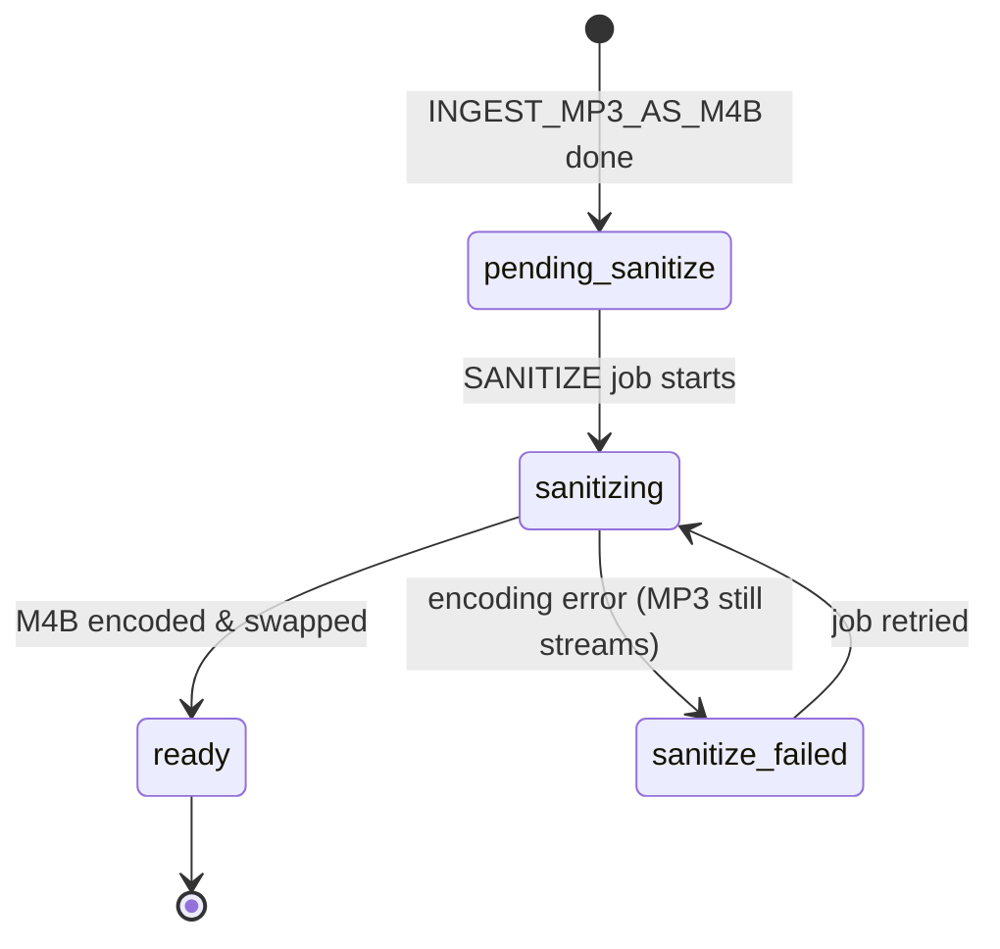

# Job Queue API — Endpoint Reference

## Overview

The Job Queue API lets clients enqueue long-running background tasks and monitor their execution. All job operations are performed asynchronously through the worker service.

## Base URL

```
/api/v1/admin/jobs
```

Backward-compatible alias: `/api/admin/jobs`

## Authentication

All job queue endpoints require:
- valid bearer access token
- `admin` role

Non-admin users receive `403 Forbidden`.

For the full admin route inventory, see [Admin API Endpoints](./admin-endpoints.md).

---

## Job Types

| Type | Purpose | Priority | Heavy? |
|---|---|---|---|
| `INGEST` | Process M4B/M4A natively | 80 | No |
| `INGEST_MP3_AS_M4B` | Fast-publish MP3, enqueue deferred conversion | 80 | No |
| `SANITIZE_MP3_TO_M4B` | Deferred MP3→M4B encoding (auto-queued) | 20 | Yes |
| `WRITE_METADATA` | Embed metadata/chapters into audio file | 35 | No |
| `EXTRACT_COVER` | Extract embedded cover from audio | 50 | No |
| `REPLACE_COVER` | Replace embedded cover and remux | 50 | No |
| `REPLACE_FILE` | Swap full audio file for a book | 20 | Yes |
| `RESCAN` | Verify library files and sync DB | 50 | No |
| `DELETE_BOOK` | Remove book record and files | 50 | No |

Heavy jobs are subject to optional time-window scheduling configured in worker settings. `SANITIZE_MP3_TO_M4B` is created automatically by `INGEST_MP3_AS_M4B` — clients should not enqueue it directly.

---

## Endpoints

### Enqueue Job

**POST** `/api/admin/jobs/enqueue`

Create and queue a new background job.

#### Request

```json
{
  "type": "INGEST",
  "payload": { "sourcePath": "/uploads/audiobook.m4b" },
  "maxAttempts": 3,
  "priority": 80,
  "runAfter": "2026-04-09T03:00:00Z"
}
```

**Body parameters**:

| Field | Type | Required | Default | Notes |
|---|---|---|---|---|
| `type` | string | ✅ | — | One of the job types listed above |
| `payload` | object | ✅ | — | Job-specific data — see payload schemas below |
| `maxAttempts` | number | | 3 | Min 1 |
| `priority` | number | | per-type default | 1–100, higher runs first |
| `runAfter` | ISO string | | now | Earliest time the job may be claimed |

#### Response — 201 Created

```json
{
  "id": "507f1f77bcf86cd799439011",
  "type": "INGEST",
  "status": "queued",
  "priority": 80,
  "payload": { "sourcePath": "/uploads/audiobook.m4b" },
  "output": null,
  "error": null,
  "attempt": 0,
  "maxAttempts": 3,
  "runAfter": "2026-04-09T10:30:00Z",
  "createdAt": "2026-04-09T10:30:00Z",
  "updatedAt": "2026-04-09T10:30:00Z",
  "startedAt": null,
  "finishedAt": null
}
```

#### Error Responses

| Status | Code | Cause |
|---|---|---|
| 400 | `job_invalid_type` | Unknown job type |
| 400 | `job_invalid_payload` | Payload missing or not an object |
| 400 | `job_invalid_max_attempts` | `maxAttempts` < 1 |

---

### Get Job Status

**GET** `/api/admin/jobs/:jobId`

#### Response — 200 OK

```json
{
  "id": "507f1f77bcf86cd799439011",
  "type": "INGEST",
  "status": "done",
  "priority": 80,
  "payload": { "sourcePath": "/uploads/audiobook.m4b" },
  "output": {
    "bookId": "507f1f77bcf86cd799439099",
    "filePath": "/data/audiobooks/507f1f77bcf86cd799439099/audio.m4b",
    "coverPath": "/data/audiobooks/507f1f77bcf86cd799439099/cover.jpg",
    "checksum": "sha256:a1b2c3d4e5f6...",
    "duration": 86400,
    "title": "The Great Gatsby",
    "author": "F. Scott Fitzgerald",
    "chapters": 42
  },
  "error": null,
  "attempt": 1,
  "maxAttempts": 3,
  "runAfter": "2026-04-09T10:30:00Z",
  "createdAt": "2026-04-09T10:30:00Z",
  "updatedAt": "2026-04-09T10:30:15Z",
  "startedAt": "2026-04-09T10:30:05Z",
  "finishedAt": "2026-04-09T10:30:15Z"
}
```

#### Status Values

| Value | Meaning |
|---|---|
| `queued` | Waiting to be claimed by the worker |
| `running` | Currently executing |
| `retrying` | Failed; scheduled for retry with exponential backoff |
| `done` | Completed successfully — `output` is populated |
| `failed` | Permanently failed (max retries exceeded) |

`output` is `null` for all statuses except `done`.

---

### Output Schemas By Job Type

#### `INGEST`

```json
{
  "bookId": "...",
  "filePath": "/data/audiobooks/.../audio.m4b",
  "coverPath": "/data/audiobooks/.../cover.jpg",
  "checksum": "sha256:a1b2c3d4...",
  "duration": 86400,
  "title": "The Great Gatsby",
  "author": "F. Scott Fitzgerald",
  "chapters": 42
}
```

#### `INGEST_MP3_AS_M4B`

Returns immediately after MP3 is copied and book is published. A `SANITIZE_MP3_TO_M4B` job is enqueued automatically.

```json
{
  "bookId": "...",
  "filePath": "/data/audiobooks/.../audio.mp3",
  "coverPath": null,
  "checksum": "sha256:...",
  "duration": 14400,
  "title": "My Audiobook",
  "author": "Some Author",
  "processingState": "pending_sanitize"
}
```

The book's `processingState` transitions as the sanitize job runs:



#### `SANITIZE_MP3_TO_M4B`

```json
{
  "bookId": "...",
  "filePath": "/data/audiobooks/.../audio.m4b",
  "checksum": "sha256:...",
  "duration": 14402
}
```

#### `WRITE_METADATA`

```json
{
  "bookId": "...",
  "filePath": "/data/audiobooks/.../audio.m4b",
  "title": "The Great Gatsby",
  "author": "F. Scott Fitzgerald",
  "series": "Classic Literature",
  "genre": "Audiobook",
  "chapters": 42
}
```

#### `EXTRACT_COVER`

```json
{ "bookId": "...", "coverPath": "/data/audiobooks/.../cover.jpg", "skipped": false }
```

```json
{ "bookId": "...", "coverPath": "...", "skipped": true, "reason": "cover_already_exists" }
```

#### `DELETE_BOOK`

```json
{ "bookId": "...", "deleted": true, "filesDeleted": true }
```

#### `REPLACE_FILE`

```json
{
  "bookId": "...",
  "filePath": "/data/audiobooks/.../audio.m4b",
  "sourcePath": "/uploads/new-file.m4b",
  "checksum": "sha256:4f4ddf9c...",
  "duration": 87211,
  "chapters": 44,
  "coverPath": "/data/audiobooks/.../cover.jpg"
}
```

#### `RESCAN`

```json
{
  "force": false,
  "targetCount": 27,
  "scanned": 27,
  "updated": 25,
  "missing": 1,
  "errors": 1
}
```

---

### List Jobs

**GET** `/api/admin/jobs`

#### Query Parameters

| Param | Type | Default | Notes |
|---|---|---|---|
| `status` | string | — | Filter: `queued` `running` `retrying` `done` `failed` |
| `type` | string | — | Filter by job type |
| `limit` | number | 20 | Max 100 |
| `offset` | number | 0 | |

#### Response — 200 OK

```json
{
  "jobs": [ /* JobDTO array */ ],
  "total": 42
}
```

---

### Get Job Statistics

**GET** `/api/admin/jobs/stats`

#### Response — 200 OK

```json
{
  "queued": 3,
  "running": 1,
  "retrying": 0,
  "done": 142,
  "failed": 2
}
```

---

### Cancel Job

**DELETE** `/api/admin/jobs/:jobId`

Cancels a `queued` job. Jobs that are already `running`, `done`, or `failed` cannot be cancelled.

#### Response — 200 OK

```json
{ "cancelled": true }
```

#### Error Responses

| Status | Code | Cause |
|---|---|---|
| 404 | `job_not_found` | Job does not exist |
| 409 | `job_not_cancellable` | Job is not in `queued` status |

---

### Get Job Logs

**GET** `/api/admin/jobs/:jobId/logs`

Returns structured runtime log entries persisted during job execution.

#### Response — 200 OK

```json
{
  "logs": [
    { "level": "info", "message": "MP3 ingest started — fast path", "data": { "sourcePath": "..." }, "ts": "2026-04-09T10:30:01Z" },
    { "level": "info", "message": "Checksum computed", "data": { "checksum": "sha256:..." }, "ts": "2026-04-09T10:30:04Z" }
  ]
}
```

---

### Worker Settings

**GET** `/api/admin/worker-settings`

Returns the current DB-backed worker scheduling policy.

**PATCH** `/api/admin/worker-settings`

Updates the scheduling policy.

#### Shape

```json
{
  "queue": {
    "heavyJobTypes": ["SANITIZE_MP3_TO_M4B", "REPLACE_FILE"],
    "heavyJobDelayMs": 0,
    "heavyWindowEnabled": false,
    "heavyWindowStart": "03:00",
    "heavyWindowEnd": "05:00"
  }
}
```

| Field | Type | Notes |
|---|---|---|
| `heavyJobTypes` | string[] | Job types treated as "heavy" |
| `heavyJobDelayMs` | number | Extra ms added to `runAfter` when enqueuing heavy jobs |
| `heavyWindowEnabled` | boolean | If true, heavy jobs only run inside the window |
| `heavyWindowStart` | string | `HH:MM` server-local time |
| `heavyWindowEnd` | string | `HH:MM` server-local time. Midnight crossover is supported (e.g. `23:00`–`01:00`) |

Changes propagate to the worker within `WORKER_SETTINGS_REFRESH_MS` (default 15 s).

---

## TypeScript Client Types

```typescript
export type JobType =
  | "INGEST"
  | "INGEST_MP3_AS_M4B"
  | "SANITIZE_MP3_TO_M4B"
  | "WRITE_METADATA"
  | "EXTRACT_COVER"
  | "REPLACE_COVER"
  | "REPLACE_FILE"
  | "RESCAN"
  | "DELETE_BOOK";

export type JobStatus = "queued" | "running" | "retrying" | "done" | "failed";

export interface JobDTO {
  id: string;
  type: JobType;
  status: JobStatus;
  priority: number;
  payload: unknown;
  output: Record<string, unknown> | null;
  error: { code: string; message: string; at: string } | null;
  attempt: number;
  maxAttempts: number;
  runAfter: string;
  createdAt: string;
  updatedAt: string;
  startedAt: string | null;
  finishedAt: string | null;
}
```

## Related Docs

- [Admin API Endpoints](./admin-endpoints.md)
- [Worker Technical Reference](../worker/technical-reference.md)
- [API–Worker Integration Guide](../platform/api-worker-integration.md)
