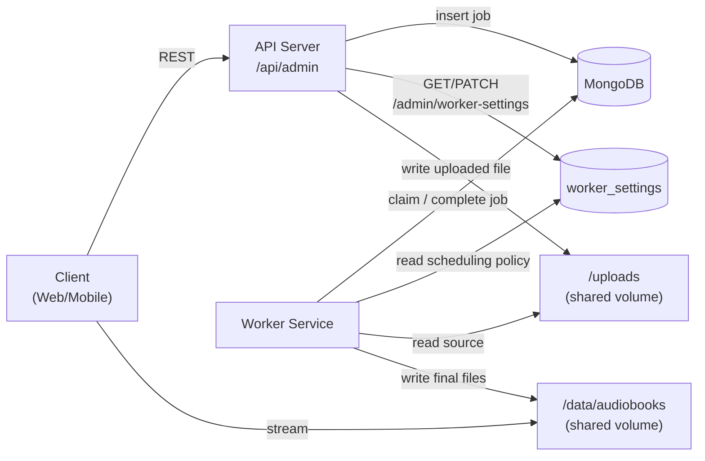
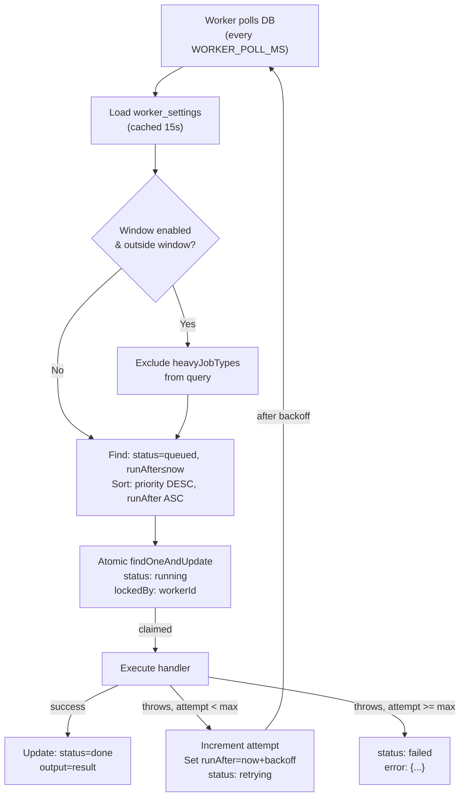
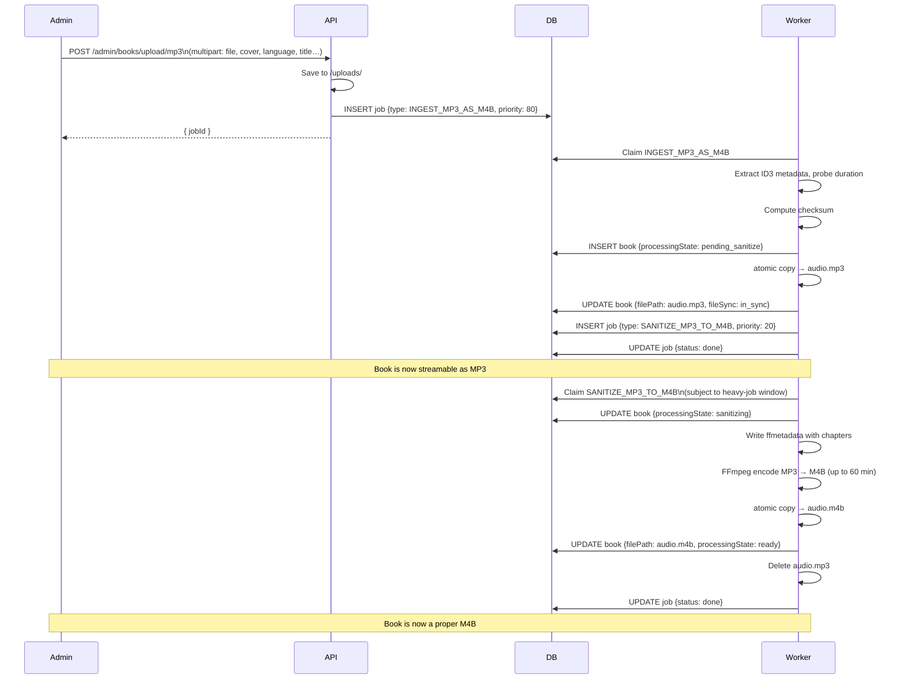
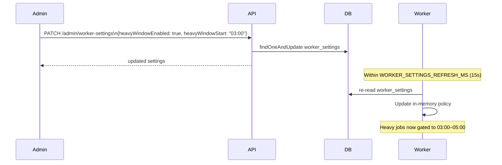

# Audiobook Platform — API & Worker Integration Guide

## Overview

This document describes the complete integration between the API server and the background worker service for processing audiobooks asynchronously. It covers the shared job queue, scheduling policy, and all job type flows.

---

## Architecture



---

## Data Model

### Job Document

```typescript
{
  _id: ObjectId;
  type: JobType;               // See job types below
  status: "queued" | "running" | "retrying" | "done" | "failed";
  priority: number;            // 1–100; worker sorts by priority DESC
  payload: Record<string, unknown>;
  output: Record<string, unknown> | null;   // Populated on done
  error: { code: string; message: string; stack?: string; at: string } | null;
  attempt: number;
  maxAttempts: number;
  runAfter: Date;              // Earliest claim time (deferred or retry)
  lockedBy: string | null;     // workerId currently processing
  lockedAt: Date | null;
  createdAt: Date;
  updatedAt: Date;
  startedAt: Date | null;
  finishedAt: Date | null;
}
```

### Worker Settings Document (singleton)

Stored in `worker_settings` collection with `key: "worker"`. Read by the worker on each poll cycle (cached 15 s).

```typescript
{
  key: "worker";
  queue: {
    heavyJobTypes: JobType[];     // default: ["SANITIZE_MP3_TO_M4B", "REPLACE_FILE"]
    heavyJobDelayMs: number;      // extra ms added to runAfter for heavy jobs
    heavyWindowEnabled: boolean;  // restrict heavy jobs to a time window
    heavyWindowStart: string;     // "HH:MM"
    heavyWindowEnd: string;       // "HH:MM" — midnight crossover supported
  }
}
```

### Book `processingState` Field

Added to the `books` collection to track the MP3 fast-publish lifecycle:

| Value | Meaning |
|---|---|
| `ready` | Fully processed M4B, normal library state |
| `pending_sanitize` | MP3 live, M4B conversion queued |
| `sanitizing` | M4B encoding currently in progress |
| `sanitize_failed` | Encoding failed; MP3 remains playable |

---

## Job Claim Flow



**Backoff formula**: `min(WORKER_RETRY_BASE_MS × 2^(attempt-1), WORKER_RETRY_MAX_MS)`  
Example (defaults): 2 s → 4 s → 8 s → 16 s → … → 60 s cap

---

## Job Types Reference

| Type | Priority | Heavy? | Auto-created? | Description |
|---|---|---|---|---|
| `INGEST` | 80 | No | No | Native M4B/M4A ingestion |
| `INGEST_MP3_AS_M4B` | 80 | No | No | Fast-publish MP3, enqueues sanitize |
| `SANITIZE_MP3_TO_M4B` | 20 | Yes | By `INGEST_MP3_AS_M4B` | Deferred MP3→M4B encode & swap |
| `WRITE_METADATA` | 35 | No | No | Embed metadata/chapters |
| `EXTRACT_COVER` | 50 | No | No | Extract embedded cover art |
| `REPLACE_COVER` | 50 | No | No | Replace cover and remux |
| `REPLACE_FILE` | 20 | Yes | No | Swap audio file for a book |
| `RESCAN` | 50 | No | No | Verify library files, sync DB |
| `DELETE_BOOK` | 50 | No | No | Remove book record and files |

---

## MP3 Upload Flow (Fast-Publish)

This is the primary upload path for MP3 files. It decouples availability from the long FFmpeg encode.



---

## M4B / M4A Upload Flow

Standard path for native M4B/M4A files. Synchronous encode is not required.

1. Admin uploads via `POST /admin/books/upload`
2. API enqueues `INGEST` (priority 80)
3. Worker: probe → checksum → extract metadata → copy → extract cover → update book
4. Book published with `processingState: "ready"`

---

## Worker Settings Flow



---

## API Routes Summary

```
# Job queue
POST   /api/admin/jobs/enqueue          Create job
GET    /api/admin/jobs                  List (filterable)
GET    /api/admin/jobs/stats            Queue counters
GET    /api/admin/jobs/:jobId           Get one job
DELETE /api/admin/jobs/:jobId           Cancel queued job
GET    /api/admin/jobs/:jobId/logs      Structured execution logs
GET    /api/admin/logs                  Recent logs across all jobs

# Worker settings
GET    /api/admin/worker-settings       Read scheduling policy
PATCH  /api/admin/worker-settings       Update scheduling policy

# Books
POST   /api/admin/books/upload          Upload M4B/M4A
POST   /api/admin/books/upload/mp3      Upload MP3 (fast-publish)
GET    /api/admin/books                 List books
GET    /api/admin/books/:bookId
PATCH  /api/admin/books/:bookId/metadata
PATCH  /api/admin/books/:bookId/chapters
POST   /api/admin/books/:bookId/extract-cover
DELETE /api/admin/books/:bookId

# Users / sessions
GET    /api/admin/users
GET    /api/admin/users/:userId
PATCH  /api/admin/users/:userId/role
GET    /api/admin/users/:userId/sessions
DELETE /api/admin/users/:userId/sessions
```

---

## Environment Variables

### Shared (both API and worker read the same `.env`)

```bash
MONGO_URI=mongodb://user:pass@db:27017/audiobook?authSource=admin
AUDIOBOOKS_PATH=/data/audiobooks
```

### API

```bash
NODE_ENV=production
API_PORT=3000
JWT_SECRET=...
JWT_EXPIRES_IN=12h
REFRESH_TOKEN_DAYS=60
BCRYPT_ROUNDS=12
CORS_ALLOWED_ORIGINS=https://audiobook.example.com
UPLOAD_MAX_FILE_SIZE_BYTES=2147483648   # 2 GB

# Worker settings cache TTL (API side)
WORKER_SETTINGS_CACHE_TTL_MS=15000
```

### Worker

```bash
WORKER_POLL_MS=1500
WORKER_CONCURRENCY=1
WORKER_RETRY_BASE_MS=2000
WORKER_RETRY_MAX_MS=60000
JOB_LOG_RETENTION_DAYS=15

# FFmpeg
FFMPEG_TIMEOUT_MS=300000        # 5 min (standard jobs)
FFMPEG_LONG_TIMEOUT_MS=3600000  # 60 min (SANITIZE_MP3_TO_M4B)
FFMPEG_MAX_BUFFER_BYTES=52428800

# Heavy-job scheduling (seeds worker_settings on first run)
HEAVY_JOB_TYPES=SANITIZE_MP3_TO_M4B,REPLACE_FILE
HEAVY_JOB_DELAY_MS=0
HEAVY_JOB_WINDOW_ENABLED=false
HEAVY_JOB_WINDOW_START=03:00
HEAVY_JOB_WINDOW_END=05:00
WORKER_SETTINGS_REFRESH_MS=15000
```

---

## Operational Notes

### Stale Lock Reclaim

Every `WORKER_LOCK_RECLAIM_INTERVAL_MS` (default 5 min), worker slot 0 resets jobs that have been `running` longer than the lock interval back to `queued`. This handles cases where the worker crashed mid-job.

To manually reset a stuck job in MongoDB:

```js
db.jobs.updateOne(
  { _id: ObjectId("...") },
  { $set: { status: "queued", lockedBy: null, lockedAt: null, runAfter: new Date() } }
)
```

### Monitor the Queue

```bash
# Queue stats
curl -H "Authorization: Bearer $TOKEN" http://localhost:3000/api/admin/jobs/stats

# Failed jobs
curl -H "Authorization: Bearer $TOKEN" "http://localhost:3000/api/admin/jobs?status=failed&limit=20"

# Worker logs
docker logs audiobook-worker --tail=100

# Job execution logs (per-job)
curl -H "Authorization: Bearer $TOKEN" http://localhost:3000/api/admin/jobs/$JOB_ID/logs
```

### Scale Throughput

```bash
# More concurrent jobs per instance
WORKER_CONCURRENCY=4

# Multiple worker instances (use different WORKER_IDs)
docker compose up --scale worker=2
```

---

## Related Docs

- [Jobs API Endpoints](../api/jobs-endpoints.md)
- [Admin API Endpoints](../api/admin-endpoints.md)
- [Worker Technical Reference](../worker/technical-reference.md)
