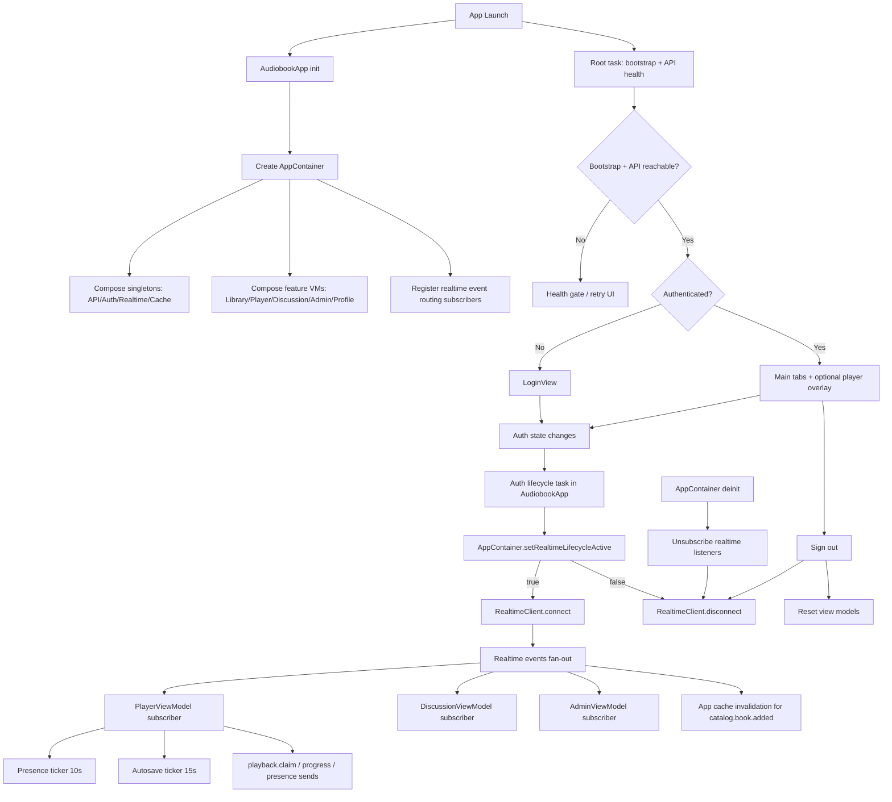

# Apple StoryWave Lifecycle Architecture

This file documents the current StoryWave Apple app lifecycle and ownership model.

It should be updated whenever startup/auth/realtime/task ownership changes.

## Lifecycle Flow

## Ownership Rules

- `AppContainer` owns singleton services and realtime transport lifecycle.
- Feature view models own domain behavior and event application logic.
- `PlayerViewModel` subscribes to realtime events but does not own socket connect/disconnect.
- Auth transition (`isAuthenticated`) is the source of truth for realtime transport activation.
- API polling should be fallback/domain-specific only (for example, job logs view), not app-wide.

## Event Routing Map

- `playback.session.presence`, `playback.claimed`, `progress.synced` -> `PlayerViewModel`
- `discussion.message.created`, `discussion.message.deleted` -> `DiscussionViewModel`
- `job.state.changed` -> `AdminViewModel`
- `catalog.book.added` -> `AppCacheService.invalidateLibrary()`
