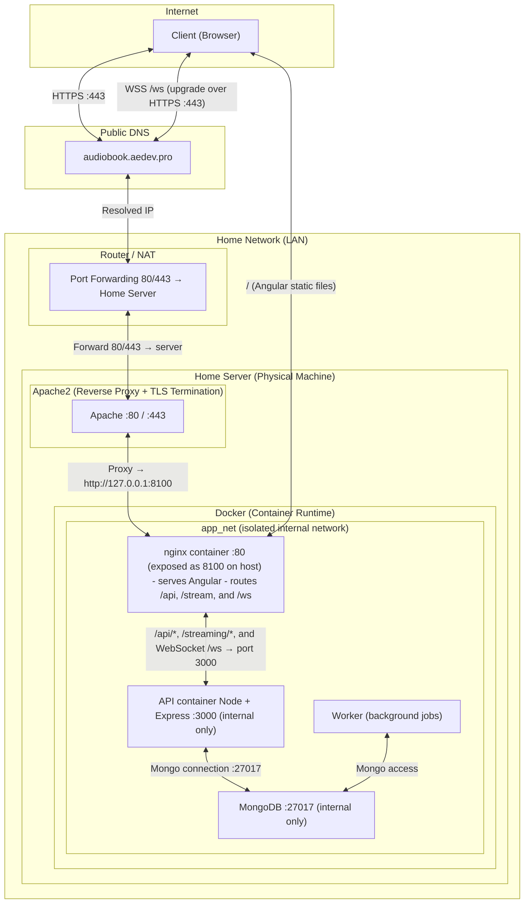

# Audiobook Platform — Architecture & Build Specification 

------

# 0. File Tree (current)
```text
audiobook-platform/
├── docker-compose.yml
├── README.md
├── api/
│   ├── Dockerfile
│   ├── package.json
│   └── src/
│       ├── app.ts
│       ├── server.ts
│       ├── bootstrap/
│       ├── config/
│       ├── dto/
│       │   ├── admin.dto.ts
│       │   ├── auth.dto.ts
│       │   ├── book.dto.ts
│       │   ├── collection.dto.ts
│       │   ├── common.dto.ts
│       │   ├── discussion.dto.ts
│       │   ├── job.dto.ts
│       │   ├── progress.dto.ts
│       │   ├── series.dto.ts
│       │   ├── session.dto.ts
│       │   ├── settings.dto.ts
│       │   ├── stats.dto.ts
│       │   └── user.dto.ts
│       ├── middlewares/
│       │   ├── auth.middleware.ts
│       │   ├── cors.middleware.ts
│       │   ├── error.middleware.ts
│       │   ├── idempotency.middleware.ts
│       │   ├── rate-limit.middleware.ts
│       │   └── role.middleware.ts
│       ├── modules/
│       │   ├── admin/
│       │   ├── auth/
│       │   ├── books/
│       │   ├── collections/
│       │   ├── discussions/
│       │   ├── jobs/
│       │   ├── progress/
│       │   ├── series/
│       │   ├── settings/
│       │   ├── stats/
│       │   ├── streaming/
│       │   └── users/
│       ├── realtime/
│       │   ├── realtime.events.ts
│       │   └── realtime.gateway.ts
│       ├── services/
│       │   ├── chapter.service.ts
│       │   ├── cover.service.ts
│       │   ├── ffmpeg.service.ts
│       │   ├── file.service.ts
│       │   ├── ingest.service.ts
│       │   └── metadata.service.ts
│       └── utils/
├── worker/
│   ├── Dockerfile
│   ├── package.json
│   └── src/
│       ├── worker.ts
│       ├── jobs/
│       │   ├── delete-book.job.ts
│       │   ├── extract-cover.job.ts
│       │   ├── ingest-mp3-as-m4b.job.ts
│       │   ├── ingest.job.ts
│       │   ├── replace-cover.job.ts
│       │   ├── replace-file.job.ts
│       │   ├── rescan.job.ts
│       │   ├── sanitize-mp3.job.ts
│       │   ├── sync-tags.job.ts
│       │   └── write-metadata.job.ts
│       ├── queue/
│       ├── services/
│       │   ├── checksum.service.ts
│       │   ├── ffmpeg.service.ts
│       │   ├── file.service.ts
│       │   ├── metadata.service.ts
│       │   ├── mp3-metadata.service.ts
│       │   ├── parity-scheduler.service.ts
│       │   ├── tag-sync-scheduler.service.ts
│       │   └── worker-settings.service.ts
│       └── utils/
├── ffmpeg/
│   ├── Dockerfile
│   ├── scripts/
│   └── templates/
├── frontend/
│   ├── angular.json
│   ├── package.json
│   └── src/
│       └── app/
│           ├── app.routes.ts
│           ├── core/
│           │   ├── guards/
│           │   └── services/
│           │       ├── admin-upload-queue.service.ts
│           │       ├── admin.service.ts
│           │       ├── api.service.ts
│           │       ├── auth.service.ts
│           │       ├── completed-books.service.ts
│           │       ├── config.service.ts
│           │       ├── discussion.service.ts
│           │       ├── i18n.service.ts
│           │       ├── library-progress.service.ts
│           │       ├── library.service.ts
│           │       ├── player.service.ts
│           │       ├── progress.service.ts
│           │       ├── realtime.service.ts
│           │       ├── settings.service.ts
│           │       └── stats.service.ts
│           ├── features/
│           │   ├── admin/
│           │   ├── auth/
│           │   ├── discussions/
│           │   ├── history/
│           │   ├── legal/
│           │   ├── library/
│           │   ├── player/
│           │   ├── profile/
│           │   └── stats/
│           └── shared/
├── infra/
│   └── nginx/
└── docs/
  ├── api/
  ├── ffmpeg/
  ├── platform/
  └── worker/
```




# 1. Objective

- Local audiobook platform focused on M4B support
- Multi-user access with authentication
- Admin-controlled media and metadata management
- Cross-device progress sync
- Web-first access via Angular PWA
- Fully containerized deployment
- Rich user playback preferences and listening history
- Analytics and per-user usage statistics

------

# 2. Core Principles

## Separation of concerns

| Concern                       | Source of truth      |
| ----------------------------- | -------------------- |
| Audio files                   | Filesystem           |
| UI metadata                   | Database             |
| Progress and completion state | Database             |
| Embedded file metadata        | Derived and syncable |
| User preferences              | Database             |
| User listening statistics     | Database             |

## Runtime model

- UI reads database-backed API only
- Streaming reads filesystem via DB lookup
- Realtime UI updates use a same-origin WebSocket connection at `/ws`
- WebSocket transport carries push events only; durable state still lives in DB-backed API endpoints
- File mutations happen only through controlled jobs
- No direct manual mutation path from UI to file system internals

Notes:

- the canonical REST base is `/api/v1`
- streaming endpoints are mounted separately at `/streaming`
- nginx still contains a `/stream/` compatibility proxy location, but the implemented API routes live under `/streaming`

## Write model

- DB = working state
- File = portable media state
- Jobs = synchronization layer between DB and files

------

# 3. Stack

## Backend

- Node.js + Express
- WebSocket server layered onto the same HTTP server for realtime fan-out
- MongoDB
- ffmpeg and ffprobe
- Worker processes for ingestion and file rewrite jobs

## Frontend

- Angular SPA
- PWA support
- EN/FR UI support

## Infrastructure

- Docker Compose
- Reverse proxy on host machine
- HTTPS terminated at host reverse proxy
- Host-mounted audiobook storage

------

# 4. Storage Layout

Host filesystem outside containers:

```text
/data/audiobooks
  /<bookId>/
    audio.m4b
    cover.jpg
    audio.tmp.m4b
```

Rules:

- One folder per book
- Temp file stays on same filesystem as final file
- Atomic rename required for final replacement
- Containers never store audiobook media in Docker volumes

------

# 5. High-Level Architecture

## Services

- `frontend` — Angular app served by nginx
- `api` — Express API for auth, library, progress, settings, stats, admin actions, streaming, and realtime WebSocket events
- `db` — MongoDB
- `worker` — background job processor

Worker runtime details:

- one job runner consumes queued jobs from Mongo-backed state
- parity and tag-sync schedulers run alongside the main job runner in the worker process

## Networks

- Internal application network only
- DB not exposed publicly
- WebSocket traffic enters through the same public HTTPS entrypoint and is proxied internally to the API container

## Realtime transport

- Browser clients connect to `wss://<domain>/ws`
- Apache terminates TLS and preserves HTTP upgrade headers
- nginx forwards the upgraded `/ws` connection to the API container
- the API hosts the WebSocket gateway on the same Node process as the REST API
- server-originated events include job-state changes, catalog insertions, and other UI refresh signals
- client-originated events are restricted to validated playback coordination messages such as presence, playback claims, and progress sync
- realtime is advisory transport, not the source of truth: reconnecting clients must always recover state from normal API endpoints

Current server-originated event examples:

- `job.state.changed`
- `catalog.book.added`
- `system.connected`

Current client-originated event examples:

- `playback.session.presence`
- `playback.claim`
- `playback.progress`

## WebSocket deployment model

This project does **not** run a separate websocket microservice.

The realtime server is currently:

- the same Node.js process as the REST API
- inside the same `api` Docker container
- listening on the same internal port (`3000`)
- attached to the same HTTP server instance used by Express

Concretely, the startup path is:

```text
api/src/server.ts
→ createApp()
→ createServer(app)
→ new RealtimeGateway()
→ realtime.start(server)
→ server.listen(env.port)
```

That means `/api/v1/*`, `/streaming/*`, and `/ws` are all ultimately served by the same backend service.
There is no dedicated websocket container, no second Node port, and no separate realtime network segment.

## Exact websocket network path

For a browser websocket connection, the request path is:

```text
Browser
→ wss://audio.aedev.pro/ws
→ public DNS
→ router/NAT on 443
→ Apache on the host machine (TLS termination)
→ nginx container on 127.0.0.1:8100
→ location /ws
→ proxy_pass http://api:3000/ws
→ API container
→ Node HTTP server
→ RealtimeGateway attached to that server
```

Important implications:

- the browser only sees one public origin
- websocket traffic does not bypass nginx or Apache
- the API container is still internal-only on `app_net`
- only nginx is exposed to the host in Docker Compose
- websocket upgrade headers must survive Apache and nginx forwarding unchanged

## What actually handles the websocket upgrade

The upgrade is handled in two layers:

1. Reverse proxies:
Apache forwards the HTTPS request to nginx.
nginx detects `/ws`, sets `Upgrade` and `Connection: upgrade`, and proxies to `http://api:3000/ws`.

2. Node API server:
`server.ts` creates a single `http.Server` for Express.
`RealtimeGateway.start(server)` attaches a `WebSocketServer` from `ws` with `path: "/ws"` to that same server.

This is why the correct architectural description is:

- REST API and websocket server are the same backend service
- websocket is an additional transport exposed by the API, not its own subsystem at deployment level

## What the websocket layer is responsible for

The realtime gateway is intentionally narrow in scope. It currently provides:

- fan-out of server-side events such as job status changes and new book insertions
- playback-session coordination between browser clients
- lightweight progress synchronization signals between active clients
- connection lifecycle signaling such as `system.connected`

It does **not** replace the normal API.
Clients still need the REST endpoints for authoritative reads, auth, persistence, and recovery after reconnect.

## How events are produced today

The gateway uses a hybrid strategy rather than a full event bus service:

- in-process realtime events are subscribed through `realtime.events.ts`
- a polling loop fills gaps for database-backed changes that are not yet emitted everywhere as domain events
- client messages are accepted only for a small whitelist of playback-related event types

This keeps realtime simple for the current single-API-instance deployment.

## Current architectural consequence

Because websocket clients and realtime listeners are stored in-process inside the API container, the current design is best described as:

- a single API service that also happens to provide realtime capabilities
- suitable for the current deployment model where one API instance is the expected runtime shape

If the platform were later scaled to multiple API instances, websocket fan-out and in-process event delivery would need an external pub/sub layer to stay consistent across instances.

## Mounts and volumes

### Host mount

- `/data/audiobooks` mounted into `api` and `worker`

### Docker volumes

- MongoDB data
- app temp/logs if needed

------

# 6. Data Model

## books

```json
{
  "_id": "...",
  "filePath": "/data/audiobooks/<bookId>/audio.m4b",
  "checksum": "sha256:...",

  "title": "...",
  "author": "...",
  "series": "...",
  "seriesIndex": 1,
  "duration": 12345,
  "language": "fr",

  "chapters": [
    { "index": 0, "title": "Chapter 1", "start": 0, "end": 320 },
    { "index": 1, "title": "Chapter 2", "start": 320, "end": 610 }
  ],

  "coverPath": "/data/audiobooks/<bookId>/cover.jpg",
  "tags": [],
  "genre": "...",
  "description": {
    "default": "...",
    "fr": "...",
    "en": "..."
  },

  "overrides": {
    "title": true,
    "author": false,
    "series": true,
    "seriesIndex": true,
    "chapters": true,
    "cover": false,
    "description": true
  },

  "fileSync": {
    "status": "in_sync",
    "lastReadAt": "...",
    "lastWriteAt": "..."
  },

  "version": 1,
  "lastScannedAt": "...",
  "createdAt": "...",
  "updatedAt": "..."
}
```

Notes:

- `seriesIndex` exists specifically to avoid title-based ordering hacks
- `checksum` is mandatory for reconciliation
- `overrides` indicate which fields were intentionally normalized or edited
- `fileSync.status` values:
  - `in_sync`
  - `dirty`
  - `writing`
  - `error`

## users

```json
{
  "_id": "...",
  "email": "user@example.com",
  "passwordHash": "...",
  "role": "admin",
  "profile": {
    "displayName": "Alex",
    "preferredLocale": "fr"
  },
  "createdAt": "...",
}
```

Roles:

- `admin`
- `user`

## user_settings

```json
{
  "userId": "...",
  "locale": "fr",
  "player": {
    "forwardJumpSeconds": 30,
    "backwardJumpSeconds": 10,
    "resumeRewind": {
      "enabled": true,
      "thresholdSinceLastListenSeconds": 86400,
      "rewindSeconds": 30
    },
    "playbackRate": 1.0,
    "autoMarkCompletedThresholdSeconds": 20
  },
  "library": {
    "sortBy": "series",
    "sortOrder": "asc",
    "showCompleted": true
  },
  "updatedAt": "..."
}
```

Notes:

- forward/backward jumps are independent
- allowed jump values: `5, 10, 15, 20, 25, 30`
- sortBy: enum: ["title", "author", "lastPlayed", "series", "genre"]
- `resumeRewind` supports the "go back 30 seconds if enough time passed since last session" behavior
- settings are persisted server-side so they apply across devices

## progress

```json
{
  "userId": "...",
  "bookId": "...",

  "positionSeconds": 1542,
  "durationAtSave": 7200,
  "fileChecksumAtSave": "sha256:...",
  "bookVersionAtSave": 3,

  "lastChapterIndex": 5,
  "secondsIntoChapter": 120,

  "completed": false,
  "completedAt": null,
  "manualCompletion": false,

  "lastListenedAt": "...",
  "updatedAt": "..."
}
```

Indexes:

- unique `(userId, bookId)`

Notes:

- progress is stored in seconds, not bytes
- checksum + version snapshot are used for reconciliation
- chapter index + seconds into chapter are stored for best-quality resume behavior after repackaging/replacement
- `completed` must be explicit and not inferred only from position

## user_stats

```json
{
  "userId": "...",
  "lifetime": {
    "totalListeningSeconds": 982341,
    "completedBooksCount": 42,
    "distinctBooksStarted": 88,
    "distinctBooksCompleted": 42,
    "totalSessions": 615,
    "totalSeekCount": 170,
    "totalForwardJumps": 390,
    "totalBackwardJumps": 512,
    "lastListeningAt": "..."
  },
  "rolling": {
    "last7DaysListeningSeconds": 14400,
    "last30DaysListeningSeconds": 70200
  },
  "updatedAt": "..."
}
```

## listening_sessions

```json
{
  "_id": "...",
  "userId": "...",
  "bookId": "...",
  "startedAt": "...",
  "endedAt": "...",
  "listenedSeconds": 1840,
  "startPositionSeconds": 1200,
  "endPositionSeconds": 3040,
  "fileChecksum": "sha256:...",
  "bookVersion": 3,
  "device": "web"
}
```

Purpose:

- audit-friendly listening history
- analytics source for derived user stats
- optional future dashboards and trends

## collections

```json
{
  "_id": "...",
  "name": "Favorites",
  "bookIds": ["..."],
  "cover": null,
  "createdAt": "..."
}
```

## jobs

```json
{
  "_id": "...",
  "type": "WRITE_METADATA",
  "status": "queued",
  "payload": {},
  "error": null,
  "createdAt": "...",
  "startedAt": null,
  "finishedAt": null
}
```

Job types:

- `INGEST`
- `INGEST_MP3_AS_M4B`
- `SANITIZE_MP3_TO_M4B`
- `RESCAN`
- `SYNC_TAGS`
- `WRITE_METADATA`
- `EXTRACT_COVER`
- `REPLACE_COVER`
- `DELETE_BOOK`
- `REPLACE_FILE`

Job statuses:

- `queued`
- `running`
- `retrying`
- `done`
- `failed`

------

# 7. Authentication and Authorization

## Auth model

- JWT access token for authenticated API calls
- Refresh token rotation for long-lived authenticated sessions
- Passwords stored as hashes only

## Permissions

| Action                             | User | Admin |
| ---------------------------------- | ---- | ----- |
| View library                       | Yes  | Yes   |
| Stream audiobooks                  | Yes  | Yes   |
| Save progress                      | Yes  | Yes   |
| Mark book completed or uncompleted | Yes  | Yes   |
| Edit own settings                  | Yes  | Yes   |
| View own stats                     | Yes  | Yes   |
| Edit metadata                      | No   | Yes   |
| Upload books                       | No   | Yes   |
| Delete books                       | No   | Yes   |
| Trigger rescan                     | No   | Yes   |
| Commit metadata to file            | No   | Yes   |
| View platform-wide stats           | No   | Yes   |

------

# 8. Ingestion Pipeline

## Purpose

Central authoritative path for creating or refreshing DB state from files.

## Pipeline

```text
file detected
→ validate format
→ compute checksum
→ extract metadata
→ extract duration
→ extract chapters
→ extract cover
→ normalize fields
→ write DB
```

## Rules

- No manual DB creation for books outside ingestion path
- Unsupported file formats rejected early
- All derived display data should be materialized into DB

------

# 9. Metadata Strategy

## Why DB metadata exists even when files already contain metadata

Reasons:

- Fast indexed queries for library display
- Stable normalized values despite poor source packaging
- Search, filtering, sorting, collections, and joins with progress
- Avoid reparsing M4B metadata on each request

## Recommended model

- Embedded metadata is input data, not trusted display truth
- DB stores normalized display values
- DB may diverge intentionally from original file until a sync job applies edits back into the file

## Override flags

Used to indicate fields intentionally edited after ingest.

Examples:

- normalized book titles in a series
- repaired author field
- manually added chapters
- replaced cover image

------

# 10. Chapters

## Internal representation

```json
[
  { "index": 0, "title": "Chapter 1", "start": 0, "end": 320 },
  { "index": 1, "title": "Chapter 2", "start": 320, "end": 610 }
]
```

## Why chapters belong in DB

- Fast rendering in player UI
- Easy chapter editing in admin dashboard
- No runtime parsing dependency during playback

## Writing chapters back into M4B

Generate ffmetadata text like:

```text
;FFMETADATA1
[CHAPTER]
TIMEBASE=1/1000
START=0
END=320000
title=Chapter 1
```

Then apply through ffmpeg during a controlled write job.

------

# 11. Covers

## Strategy

Do not rely on embedded cover only.

On ingest:

- extract cover from file when available
- normalize size and format if needed
- save as separate `cover.jpg`
- store `coverPath` in DB

Benefits:

- consistent client rendering
- no repeated extraction cost
- easy replacement from admin dashboard

------

# 12. Streaming Strategy

## Endpoint

- `HEAD /streaming/books/:bookId/audio`
- `GET /streaming/books/:bookId/audio`
- `GET /streaming/books/:bookId/cover`
- `GET /streaming/books/:bookId/resume`

## Requirements

- HTTP Range support mandatory
- return `206 Partial Content`
- use `fs.createReadStream`
- never load full file in memory
- always send `Accept-Ranges: bytes`

## Lookup path

```text
bookId → DB record → filePath → createReadStream
```

## Critical rule

Streaming depends on a stable file. Never rewrite the currently served file in place.

------

# 13. Safe File Rewrite Strategy

## Problem

Admin-triggered repackaging changes byte layout. Active streams would break if original file were modified in place.

## Required solution

Use temp file plus atomic swap.

```text
audio.m4b
→ generate audio.tmp.m4b
→ validate
→ atomic rename over audio.m4b
```

## Behavior during rewrite

- Existing streams continue using old file descriptor
- New requests keep using current file until swap
- After swap, new requests use updated file
- No planned downtime required

## Rules

- Never overwrite original file in place
- Temp file must live on same filesystem
- Update DB only after successful swap and validation
- Recompute checksum after successful rewrite

------

# 14. File Sync States

## States

- `in_sync` — DB and file considered aligned
- `dirty` — DB changed, file not yet updated
- `writing` — file rewrite job in progress
- `error` — last sync job failed

## Typical transitions

```text
ingest → in_sync
admin edit → dirty
worker starts write → writing
successful swap → in_sync
failure → error
```

------

# 15. Reconciliation and Drift Control

## Problem

DB and filesystem can drift.

## Solution

Periodic scanner worker:

- scans `/data/audiobooks`
- finds new files and queues ingest
- detects checksum changes and queues refresh
- detects missing files and marks records accordingly

## Minimal strategy

Periodic scanning is sufficient. Event-based filesystem watchers can be added later.

------

# 16. Progress and Completion Model

## Completion support

Support both:

- explicit manual completion for books previously read elsewhere
- automatic completion when playback reaches the end threshold

## Completion rules

- `completed` is a stored boolean flag in `progress`
- `completedAt` records when book was marked completed
- `manualCompletion` distinguishes user-declared completion from auto-completion
- completion must survive file repackaging or replacement

## Auto-complete threshold

Use a user setting with default around 20 seconds from end:

```text
if positionSeconds >= duration - autoMarkCompletedThresholdSeconds
  completed = true
```

## Manual completion

Provide explicit API endpoint and UI action.

## Uncomplete / reset

Allow user to clear completion and continue or restart.

------

# 17. Best Resume Strategy Across File Changes

## Why bytes are wrong

Byte offsets are invalid after repackaging, metadata changes, bitrate changes, or container changes.

## Correct resume data

Store:

- `positionSeconds`
- `durationAtSave`
- `fileChecksumAtSave`
- `bookVersionAtSave`
- `lastChapterIndex`
- `secondsIntoChapter`

## Resume algorithm

### Case 1 — same checksum and version

- resume exact `positionSeconds`

### Case 2 — file changed but chapters still map well

- attempt chapter-aware resume first
- find same chapter index in current file
- resume at `chapter.start + secondsIntoChapter`
- clamp to chapter end and file duration

### Case 3 — chapter structure changed or chapters unavailable

- fallback to duration ratio:

```text
ratio = positionSeconds / durationAtSave
newPosition = ratio * currentDuration
```

### Case 4 — clearly incompatible replacement

Detect major mismatch, such as:

- chapter count collapse with no usable mapping
- extreme duration difference
- metadata mismatch suggesting wrong book

Then:

- keep original progress record
- return reconciliation warning to UI
- allow user to choose resume from computed fallback or restart

## Best implementation decision

Preferred order:

1. exact resume by checksum/version
2. chapter-aware resume
3. ratio fallback
4. user warning on suspicious mismatch

This is better than a seconds-only model and better than a ratio-only model.

------

# 18. Resume Rewind Experience

## Feature

If enough time passed since the last listening session, rewind slightly on resume.

## Why

Improves comprehension and continuity when user resumes later.

## Default behavior

- enabled by default
- if elapsed time since `lastListenedAt` exceeds configured threshold, subtract configured rewind amount from resume position

Example default:

- threshold since last listen: 24 hours
- rewind on resume: 30 seconds

## Rule

Applied after resume position is resolved through exact/chapter-aware/ratio logic.

## Clamp

```text
resumePosition = max(0, resolvedPosition - rewindSeconds)
```

------

# 19. User Settings Model

## Scope

Persist settings server-side so they follow the user across devices.

## Initial settings to support

### Playback

- forward jump seconds
- backward jump seconds
- playback rate
- resume rewind enabled
- resume rewind threshold
- resume rewind seconds
- auto-complete threshold from end

### Library

- sort field
- sort direction
- show completed items
- locale

## Allowed jump values

- `5`
- `10`
- `15`
- `20`
- `25`
- `30`

Forward and backward values are independent.

------

# 20. Listening Statistics

## Goal

Track meaningful per-user usage metrics for dashboards and history.

## Recommended statistics

### Lifetime

- total listening seconds
- total listening hours
- completed books count
- distinct books started
- distinct books completed
- total listening sessions
- total seeks
- total forward jumps
- total backward jumps
- most recent listening time

### Rolling windows

- last 7 days listening seconds
- last 30 days listening seconds

### Optional later

- most listened authors
- favorite genres
- average session length
- completion rate
- daily streaks

## Source model

- raw session data stored in `listening_sessions`
- `user_stats` acts as materialized aggregate for fast display

------

# 21. Admin System

## Purpose

Full remote management of personal server-hosted audiobook library.

## Admin features

- upload new audiobook file
- delete book
- replace file for an existing book
- edit normalized metadata
- edit chapters
- replace cover image
- trigger rescan
- commit DB metadata back into file
- inspect sync state and job history

## Important constraint

Admin UI must not mutate files directly. It triggers jobs.

------

# 22. Upload Flow

```text
upload file
→ store in temp area
→ validate
→ queue ingest
→ worker creates book folder
→ move file into final location
→ extract metadata and assets
→ create DB entry
```

Rules:

- Never write directly to final library without ingest
- Reject unsupported formats and oversized uploads early

------

# 23. Delete Flow

```text
admin delete request
→ queue delete job
→ remove DB entry or mark deleted
→ remove book folder
```

Optional later:

- soft delete
- trash retention period

------

# 24. Metadata Editing Model

## Default edit behavior

Admin edits update DB first.

Effects:

- immediate UI update
- `fileSync.status = dirty`
- no risky file rewrite during simple form editing

## Explicit commit behavior

Separate admin action: `Apply to file`

Worker then:

- builds updated metadata payload
- writes new M4B temp file through ffmpeg
- validates output
- atomically swaps file
- recomputes checksum
- updates DB sync status

This explicit split prevents accidental destructive writes.

------

# 25. Series Normalization

Never depend on title parsing for sequence ordering.

Use fields:

```json
{
  "series": "Harry Potter",
  "seriesIndex": 1
}
```

Sort by:

```text
series ASC, seriesIndex ASC
```

------

# 26. API Surface

Base path: `/api/v1`

## Auth

- `POST /api/v1/auth/login`
- `POST /api/v1/auth/register` or admin-created users only
- `POST /api/v1/auth/refresh`
- `POST /api/v1/auth/change-password`
- `POST /api/v1/auth/change-email`
- `GET /api/v1/auth/me`

## Books

- `GET /api/v1/books`
- `GET /api/v1/books/:bookId`

## Collections

- `GET /api/v1/collections`
- `POST /api/v1/collections`
- `GET /api/v1/collections/:collectionId`
- `PATCH /api/v1/collections/:collectionId`
- `DELETE /api/v1/collections/:collectionId`

## Series

- `GET /api/v1/series`
- `GET /api/v1/series/:seriesName`

## Progress

- `GET /api/v1/progress`
- `GET /api/v1/progress/:bookId`
- `PUT /api/v1/progress/:bookId`
- `POST /api/v1/progress/:bookId/complete`
- `DELETE /api/v1/progress/:bookId/complete`

## User settings

- `GET /api/v1/settings`
- `PATCH /api/v1/settings`

## User stats

- `GET /api/v1/stats/me`
- `GET /api/v1/stats/sessions`
- `POST /api/v1/stats/sessions`

## Users

- `GET /api/v1/users/me`
- `PATCH /api/v1/users/me`

## Discussions

- `GET /api/v1/discussions/channels`
- `POST /api/v1/discussions/channels`
- `DELETE /api/v1/discussions/:lang/:channelKey`
- `GET /api/v1/discussions/:lang/:channelKey/messages`
- `POST /api/v1/discussions/:lang/:channelKey/messages`
- `DELETE /api/v1/discussions/:lang/:channelKey/messages/:messageId`

## Streaming

- `HEAD /streaming/books/:bookId/audio`
- `GET /streaming/books/:bookId/audio`
- `GET /streaming/books/:bookId/cover`
- `GET /streaming/books/:bookId/resume`

## Realtime

- `GET /ws` as WebSocket upgrade endpoint
- server pushes events such as `job.state.changed`, `catalog.book.added`, and connection lifecycle messages
- clients may send validated playback coordination events such as `playback.session.presence`, `playback.claim`, and `playback.progress`
- gateway may rebroadcast normalized events such as `playback.claimed` and `progress.synced`

## Admin

- `GET /api/v1/admin/overview`
- `GET /api/v1/admin/coverage`
- `POST /api/v1/admin/books/upload`
- `POST /api/v1/admin/books/upload/mp3`
- `GET /api/v1/admin/books`
- `GET /api/v1/admin/books/:bookId`
- `PATCH /api/v1/admin/books/:bookId/metadata`
- `PATCH /api/v1/admin/books/:bookId/chapters`
- `POST /api/v1/admin/books/:bookId/cover`
- `POST /api/v1/admin/books/:bookId/extract-cover`
- `DELETE /api/v1/admin/books/:bookId`
- `POST /api/v1/admin/jobs/enqueue`
- `GET /api/v1/admin/jobs/stats`
- `GET /api/v1/admin/jobs`
- `GET /api/v1/admin/jobs/events`
- `GET /api/v1/admin/jobs/:jobId`
- `GET /api/v1/admin/jobs/:jobId/logs`
- `DELETE /api/v1/admin/jobs/:jobId`
- `GET /api/v1/admin/logs`
- `GET /api/v1/admin/worker-settings`
- `PATCH /api/v1/admin/worker-settings`
- `GET /api/v1/admin/users`
- `GET /api/v1/admin/users/:userId`
- `PATCH /api/v1/admin/users/:userId/role`
- `GET /api/v1/admin/users/:userId/sessions`
- `DELETE /api/v1/admin/users/:userId/sessions`

------

# 27. Frontend Structure

## Public routes

- `/library`
- `/series/:seriesName`
- `/collections/:collectionId`
- `/player/:bookId`
- `/login`
- `/register`
- `/profile`
- `/discussions`
- `/discussions/:lang`
- `/privacy`
- `/terms`

## Admin routes

- `/admin`
- `/admin/books`
- `/admin/books/:bookId/edit`
- `/admin/jobs`
- `/admin/jobs/:jobId/logs`
- `/admin/upload`
- `/admin/users`

## Main components

- Angular routes are lazy-loaded page components rather than one flat component list
- major page groups currently include auth, library, player, profile, discussions, and admin
- shared UI lives under `frontend/src/app/shared/ui`

## Main services

- `AuthService`
- `LibraryService`
- `PlayerService`
- `RealtimeService`
- `ProgressService`
- `SettingsService`
- `StatsService`
- `AdminService`
- `DiscussionService`
- `LibraryProgressService`
- `AdminUploadQueueService`
- `ConfigService`
- `I18nService`

------

# 28. Audio Player Rules

Single global player instance.

Responsibilities:

- load source
- play and pause
- seek
- playback rate
- sleep timer
- chapter navigation
- progress synchronization
- apply user-configured forward/backward jumps
- apply resume rewind behavior when appropriate

## Progress sync strategy

- send every 5 seconds while playing
- send on pause
- send on unload
- server is source of truth

## Session handling

- open logical listening session on playback start/resume
- close session on pause, unload, or long inactivity
- aggregate listened time into `listening_sessions` and `user_stats`

------

# 29. Library UI

## Features

- books grid
- collections grid
- filtering
- sorting
- progress indicators
- continue listening row
- completed books history

## Sorting examples

- recent added
- title
- author
- series
- progress

## Filtering examples

- author
- genre
- tags
- completion state
- language

------

# 30. i18n Strategy

## UI translations

Use Angular runtime translation files.

Example structure:

```json
{
  "nav": {
    "library": "Library",
    "admin": "Admin"
  },
  "player": {
    "play": "Play",
    "pause": "Pause"
  }
}
```

Maintain parallel files:

- `en.json`
- `fr.json`

## Content translations

No auto-translate book content.

Allow optional per-field values:

```json
{
  "description": {
    "default": "...",
    "fr": "...",
    "en": "..."
  }
}
```

Fallback order:

1. selected locale
2. `default`
3. raw field

------

# 31. Security Rules

- never expose raw host filesystem paths to clients
- validate `bookId`
- enforce role checks on admin routes
- sanitize uploads and form input
- hash passwords
- keep DB private to internal Docker network
- restrict file operations to managed library root only

------

# 32. Performance Rules

- streaming must remain O(1) memory
- no full media buffering
- no metadata parsing on normal library requests
- avoid overly frequent progress writes
- cover extraction and chapter parsing happen during jobs, not request path
- user stats should be materialized for fast UI display, not recomputed from all sessions each time

------

# 33. Docker Architecture

## Services

- `frontend`
- `api`
- `worker`
- `db`

## Compose requirements

- separate services
- internal app network
- DB not publicly exposed
- environment variables for secrets and DB connection
- audiobook storage mounted into API and worker

Example host mount:

```text
/data/audiobooks:/app/data/audiobooks
```

------

# 34. Reverse Proxy

Single domain with path-based routing:

```text
https://audio.yourdomain.com/          → frontend
https://audio.yourdomain.com/api/*     → api
https://audio.yourdomain.com/streaming/* → api
https://audio.yourdomain.com/ws        → api (WebSocket upgrade)
```

Requirements:

- `/` goes to frontend
- `/api` goes to API
- `/streaming` goes to API
- `/ws` goes to API as an HTTP upgrade request
- `/streaming` must bypass frontend entirely
- `/ws` must preserve `Upgrade` and `Connection` headers end-to-end
- HTTPS terminated at host proxy

Compatibility note:

- the current nginx config also proxies `/stream/` to the API, but the implemented backend routes are mounted under `/streaming`

Benefits:

- same-origin requests
- no CORS complexity
- cleaner frontend config

------

# 35. Constraints

Do not violate these:

- no audiobook binary storage in MongoDB
- no full file reads in memory for streaming
- no direct in-place rewrite of active media files
- no frontend-only progress truth
- no public DB exposure
- no uncontrolled file writes outside job system
- no ordering based on title parsing when `seriesIndex` exists
- no byte-based progress as primary resume source

------

# 36. Minimal Build Order

1. Docker Compose skeleton
2. MongoDB + API base
3. JWT auth
4. streaming endpoint with HTTP Range
5. progress endpoints and completion model
6. user settings endpoints
7. ingest worker
8. library DB endpoints
9. Angular player
10. Angular library UI
11. stats/session tracking
12. admin metadata editor
13. chapter editor
14. apply-to-file job flow
15. reconciliation scanner
16. i18n EN/FR

------

# 37. Result

Target result:

- containerized audiobook platform
- M4B-aware ingestion and streaming
- multi-user progress sync
- manual and automatic completion tracking
- best-effort resume across repackaging or file replacement
- server-side user settings for playback behavior
- listening history and analytics
- admin-controlled remote library management
- safe metadata normalization
- safe chapter repair and file repackaging
- EN/FR interface support
- no playback downtime during controlled file rewrites

------

# 38. Practical Summary

This project is no longer just a player.

It is a self-hosted audiobook media management platform with:

- indexed metadata
- authenticated users
- user playback preferences
- persistent completion history
- chapter-aware resume reconciliation
- session-based listening analytics
- file-aware workers
- explicit DB/file sync model
- admin-level remote control over library quality