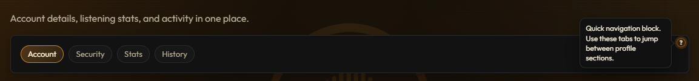

# Content Help

Generic wrapper for any content with an overlaid info tooltip.

## Why this exists

- Works for any block (cards, tabs, divs, wrappers).
- Tooltip trigger is absolutely positioned, so it does not push layout.
- Supports corner/edge anchors like `top-left` or `bottom-right`.
- Supports optional auto tooltip placement based on viewport space.
- Keeps the trigger overlaid so surrounding layout is not shifted.

## Quick use

```html
<app-content-help
  tooltip="Section overview"
  anchor="top-right"
  tooltipPlacement="auto"
  size="sm"
>
  <div class="card">Any content here</div>
</app-content-help>
```

## Inputs

- `tooltip`: Tooltip text.
- `ariaLabel`: Optional aria label for icon.
- `anchor`: `top-left | top-center | top-right | right-center | bottom-right | bottom-center | bottom-left | left-center`.
- `tooltipPlacement`: `auto | top | right | bottom | left`.
- `size`: `sm | md | lg`.
- `maxWidth`: Tooltip max width.
- `offset`: Distance from anchor edge.
- `viewportPadding`: Safety margin used by auto placement.
- `inline`: Use inline-block wrapper mode.
- `disabled`: Disable tooltip interaction.
- `closeOnOutsideClick`: Close tooltip when clicking outside.

## Screenshot

Add your screenshot in this folder and update the filename below:


