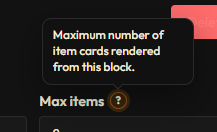

# Field Help

Reusable field wrapper with label, hint, and optional inline info tooltip.

## What it does

- Standardizes label + hint layout.
- Accepts projected form control content.
- Can show the shared info tooltip beside the label.

## Quick use

```html
<app-field-help
  label="Series"
  hint="Pick an existing series from the list"
  tooltip="Shown in the library featured section"
>
  <select>
    <option>Series A</option>
  </select>
</app-field-help>
```

## Inputs

- `label`: Field label text.
- `hint`: Optional helper text under the label.
- `tooltip`: Optional tooltip message shown with info icon.

## Screenshot

Add your screenshot in this folder and update the filename below:


