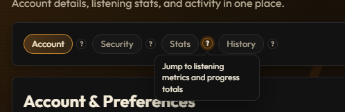

# Info Tooltip

Small reusable tooltip icon for short helper text.

## What it does

- Shows helper text on hover, focus, or click.
- Supports keyboard and screen-reader usage with tooltip aria wiring.
- Closes with Escape and (optionally) outside click.
- Supports placement: `top | right | bottom | left`.
- Supports size: `sm | md | lg`.
- Includes subtle open/close animation.

## Quick use

```html
<app-info-tooltip
  text="Shown when user hovers or focuses"
  ariaLabel="More info"
  placement="top"
  size="md"
></app-info-tooltip>
```

## Inputs

- `text`: Tooltip content.
- `ariaLabel`: Accessible label for icon button.
- `icon`: Optional icon character/string.
- `placement`: `top | right | bottom | left`.
- `size`: `sm | md | lg`.
- `maxWidth`: Max bubble width (example: `260px`).
- `disabled`: Disable interaction.
- `closeOnOutsideClick`: Close tooltip when clicking elsewhere.

## Screenshot

Add your screenshot in this folder and update the filename below:


