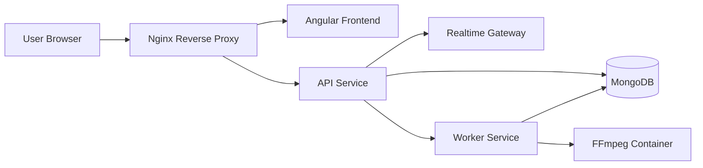
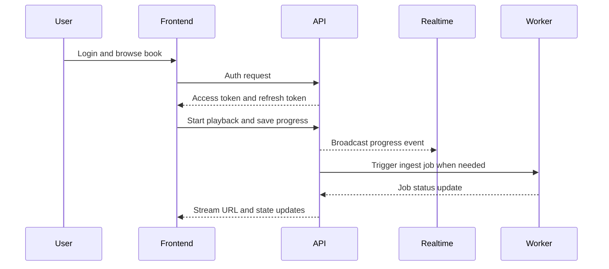
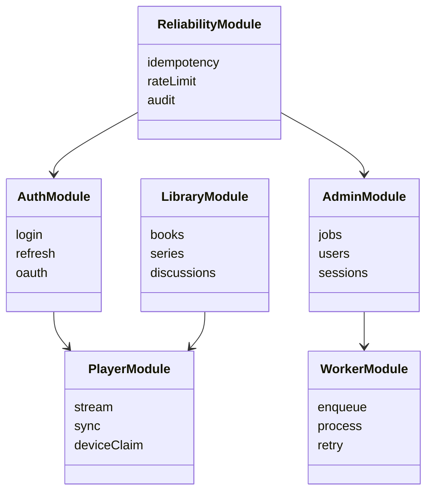

# Capsule 01 - Intro: Platform Overview and Module Roadmap

## Slide 1 - Platform Scope

- Multi tier audiobook platform: Angular frontend, Node API, Node worker, MongoDB, Nginx, Docker Compose.
- End to end product loop: authentication, discovery, playback, progress sync, realtime events, media ingestion, admin operations.
- Delivery model: containerized runtime and automated deployment workflow.

## Slide 2 - What Will Be Presented

- Capsule 02: Auth module.
- Capsule 03: Worker module.
- Capsule 04: Library and language module.
- Capsule 05: Player module.
- Capsule 06: Admin module.
- Capsule 07: Reliability module.
- Capsule 08: Deployment and delivery module.

## Slide 3 - Runtime Architecture



## Slide 4 - Cross Module User Sequence



## Slide 5 - Module Map



## Slide 6 - Evidence Snapshot

- API bootstrap and routing: `api/src/app.ts`, `api/src/server.ts`.
- Auth core: `api/src/modules/auth`.
- Playback and progress: `api/src/modules/streaming`, `api/src/modules/progress`, `frontend/src/app/core/services/player.service.ts`.
- Worker queues and handlers: `worker/src/queue`, `worker/src/jobs`.
- Infrastructure and delivery: `docker-compose.yml`, `infra/nginx/default.conf`, `.github/workflows/deploy.yml`.

## Slide 7 - Code Snapshot

```ts
// api/src/server.ts
const port = Number(process.env.PORT || 3000);
app.listen(port, () => {
  logger.info(`api listening on ${port}`);
});
```

```yaml
# docker-compose.yml
services:
  api:
    build: ./api
  worker:
    build: ./worker
  ffmpeg:
    build: ./ffmpeg
```

<!-- screenshot: full stack topology view -->
