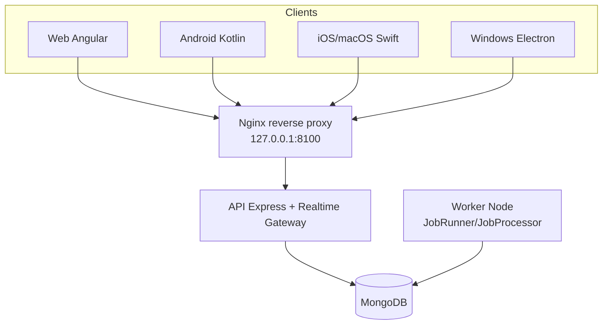
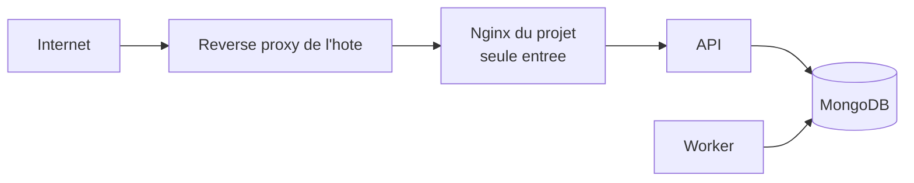

# Diagrammes - Capsule 02

## Vue runtime



## Exposition minimale



## Pipeline API simplifie

```mermaid
flowchart LR
  RQ[Request] --> JSON[express.json]
  JSON --> CORS[corsMiddleware]
  CORS --> RL[globalRateLimiter]
  RL --> RT[route dispatch]

  RT --> AUTH[/api/v1/auth]
  RT --> PROT[/api/v1/protected]
  RT --> ADMIN[/api/v1/admin]
  RT --> STR[/streaming]

  PROT --> AM[authMiddleware]
  ADMIN --> AM --> ROLE[requireRole admin]
  STR --> SAM[streamAuthMiddleware]
```
