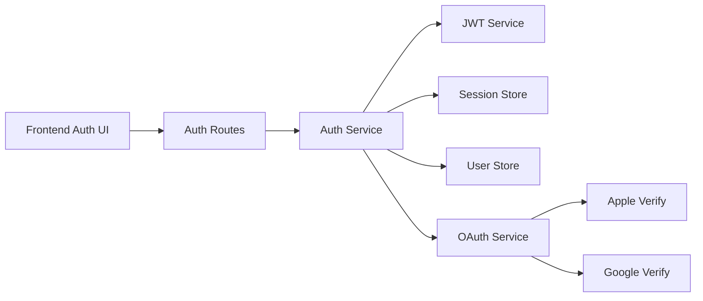
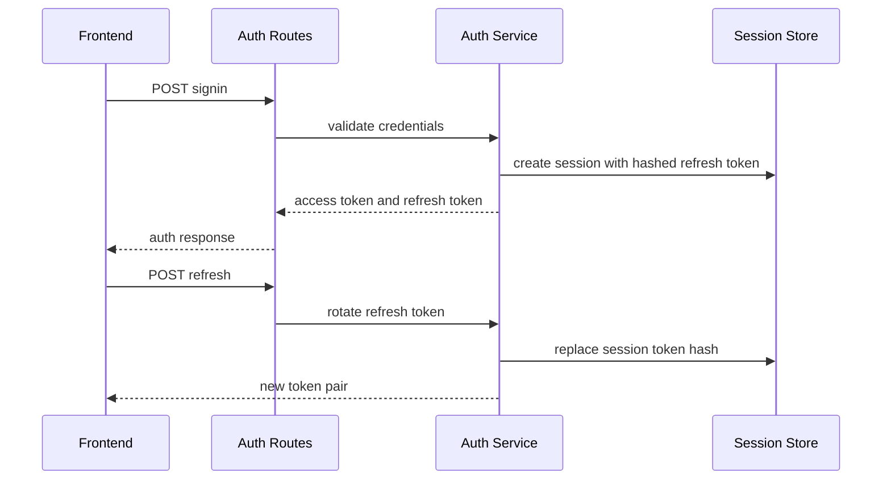
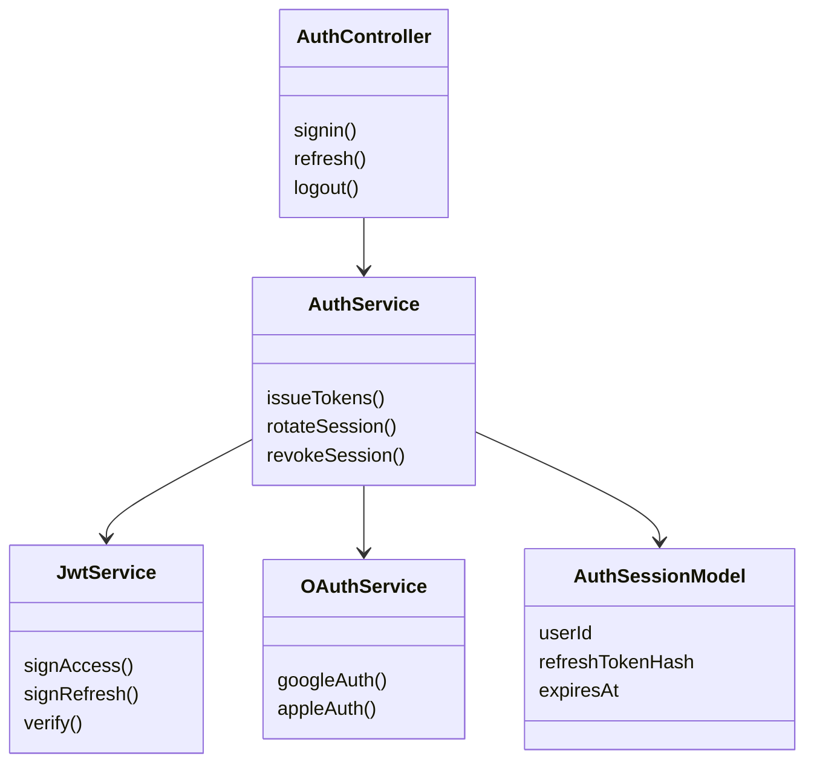
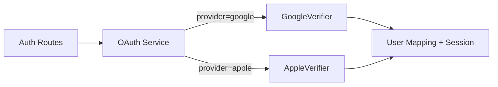
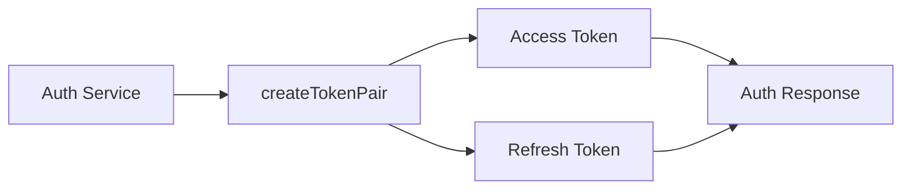
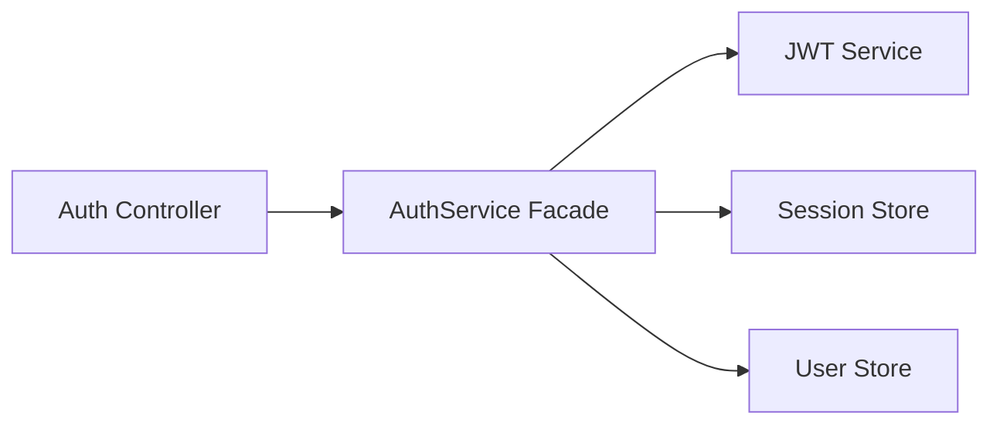

# Capsule 02 - Auth Module

## 1. Module Scope

- Identity lifecycle: signup, signin, refresh rotation, logout, session tracking.
- External identity: Google OAuth and Apple identity validation.
- Security boundaries: abuse throttling, token hashing, session revocation.

## 2. Capability Set

- Access and refresh JWT issuance.
- Refresh token rotation with persisted hashed token references.
- OAuth exchange mapped to internal user identity and session.
- Admin session visibility and cleanup hooks.

## 3. Architecture Flow Diagram



## 4. Sequence Diagram



## 5. Class Diagram



## 6. Evidence Files

- `api/src/modules/auth/auth.routes.ts`
- `api/src/modules/auth/auth.service.ts`
- `api/src/modules/auth/oauth.service.ts`
- `api/src/modules/auth/session.model.ts`
- `api/src/modules/auth/jwt.ts`

## 7. Code Proof Snippets

```ts
// api/src/modules/auth/auth.service.ts
const refreshTokenHash = await hashRefreshToken(rawRefreshToken);
await AuthSessionModel.create({ userId, refreshTokenHash, expiresAt });
```

```ts
// api/src/modules/auth/oauth.service.ts
const applePayload = await verifyAppleIdentityToken(identityToken);
const googleProfile = await verifyGoogleIdToken(idToken);
```

## 8. GoF Patterns Demonstrated

- Strategy
  - What it does: encapsulates provider specific verification behind one contract so auth flows can switch between Apple and Google without changing route/controller code.

```ts
// api/src/modules/auth/oauth.service.ts
interface OAuthVerifier {
  verify(idToken: string): Promise<{ email: string; providerUserId: string }>;
}

class GoogleVerifier implements OAuthVerifier {
  async verify(idToken: string) {
    return verifyGoogleIdToken(idToken);
  }
}

class AppleVerifier implements OAuthVerifier {
  async verify(idToken: string) {
    return verifyAppleIdentityToken(idToken);
  }
}
```



- Factory Method
  - What it does: centralizes token creation rules so access and refresh tokens are generated consistently per auth mode.

```ts
// api/src/modules/auth/auth.service.ts
function createTokenPair(userId: string, mode: 'password' | 'oauth') {
  const access = jwtService.signAccess({ sub: userId, mode });
  const refresh = jwtService.signRefresh({ sub: userId, mode });
  return { access, refresh };
}
```



- Facade
  - What it does: offers one entry point (`AuthService`) over JWT signing, session persistence, and user lookup to keep controller logic thin.

```ts
// api/src/modules/auth/auth.service.ts
async function signin(email: string, password: string) {
  const user = await userStore.verifyCredentials(email, password);
  const tokens = createTokenPair(user.id, 'password');
  await sessionStore.save(user.id, tokens.refresh);
  return { user, tokens };
}
```



<!-- screenshot: signin page -->
<!-- screenshot: session list in admin -->
