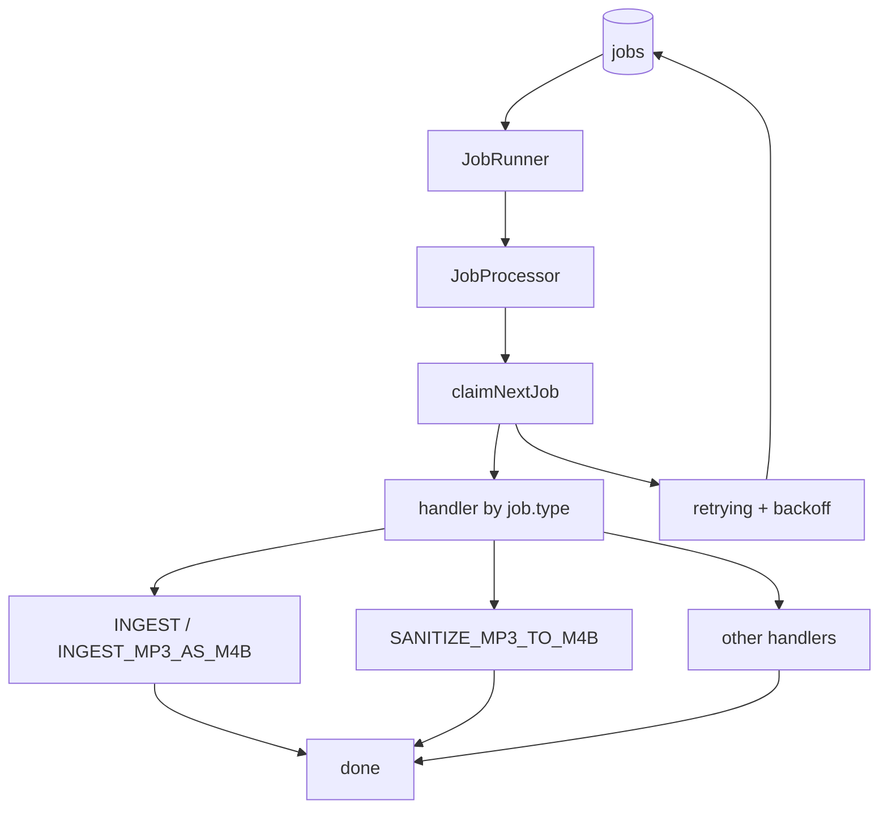
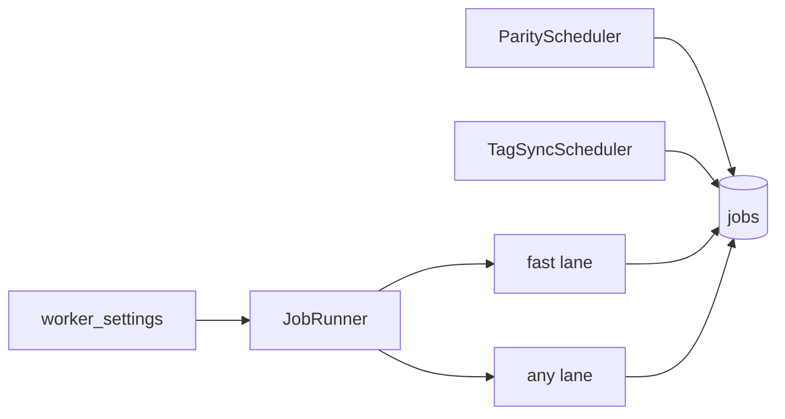
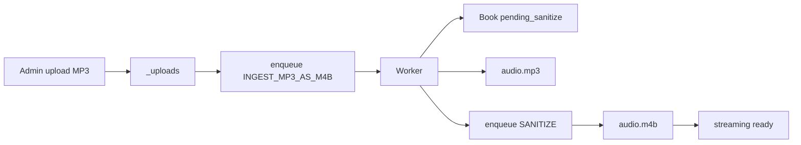

# Diagrammes - Capsule 03

## Worker orchestration

```mermaid
flowchart TD
  JQ[(jobs)] --> RUN[JobRunner]
  RUN --> PROC[JobProcessor]
  PROC --> CLAIM[claimNextJob]

  CLAIM --> H[handler by job.type]
  H --> I[INGEST / INGEST_MP3_AS_M4B]
  H --> S[SANITIZE_MP3_TO_M4B]
  H --> O[other handlers]

  I --> DONE[done]
  S --> DONE
  O --> DONE
  CLAIM --> RETRY[retrying + backoff]
  RETRY --> JQ
```

## Schedulers + lanes

```mermaid
flowchart LR
  SETTINGS[worker_settings] --> RUNNER[JobRunner]
  RUNNER --> FAST[fast lane]
  RUNNER --> ANY[any lane]
  PS[ParityScheduler] --> JOBS[(jobs)]
  TS[TagSyncScheduler] --> JOBS
  FAST --> JOBS
  ANY --> JOBS
```

## Media pipeline

```mermaid
flowchart LR
  A[Admin upload MP3] --> U[_uploads]
  U --> JQ[enqueue INGEST_MP3_AS_M4B]
  JQ --> W[Worker]
  W --> B[Book pending_sanitize]
  W --> MP3[audio.mp3]
  W --> SJ[enqueue SANITIZE]
  SJ --> M4B[audio.m4b]
  M4B --> ST[streaming ready]
```
