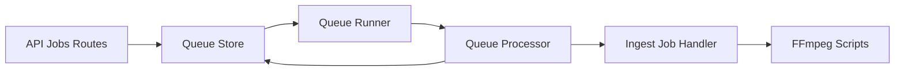
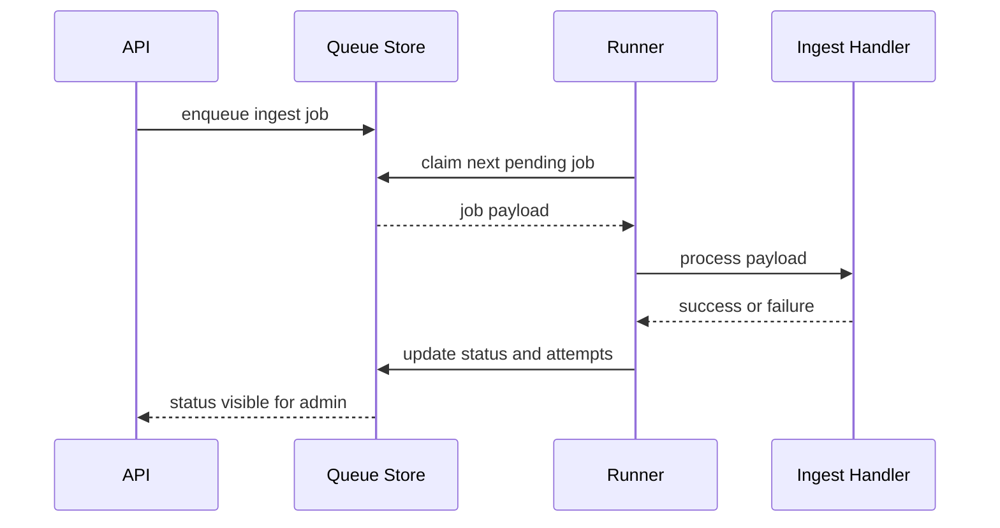
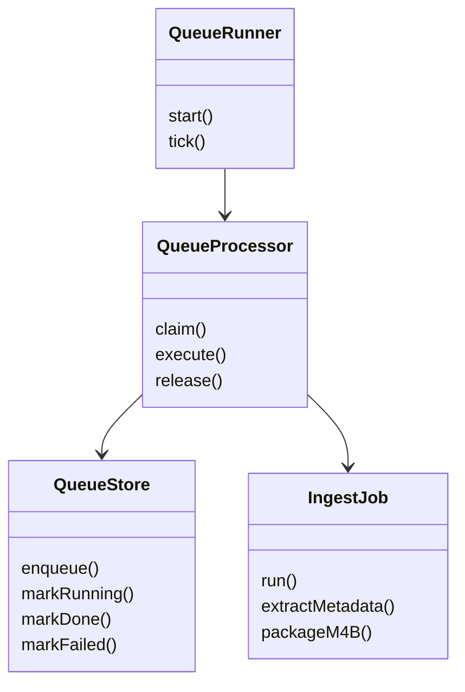
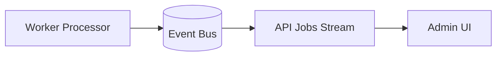

# Capsule 03 - Worker Module

## 1. Module Scope

- Media ingestion and transformation pipeline.
- Queue lanes, locking, retries, and stale lock recovery.
- Status propagation to API and admin supervision.

## 2. Capability Set

- Job enqueue from API.
- Lane based execution with polling loop.
- FFmpeg integration for metadata, cover, and chapter packaging.
- Retry policy and dead failure visibility.

## 3. Architecture Flow Diagram



## 4. Sequence Diagram



## 5. Class Diagram



## 6. Evidence Files

- `worker/src/queue/runner.ts`
- `worker/src/queue/processor.ts`
- `worker/src/jobs/ingest-mp3-as-m4b.job.ts`
- `worker/src/queue/retry-policy.ts`
- `ffmpeg/scripts/extract-metadata.sh`

## 7. Code Proof Snippets

```ts
// worker/src/queue/processor.ts
if (job.attempts < retryPolicy.maxAttempts) {
  await queueStore.reschedule(job.id, retryPolicy.nextDelayMs(job.attempts));
}
```

```ts
// worker/src/jobs/ingest-mp3-as-m4b.job.ts
await writeChapters(tempMetaPath, chapterList);
await packageM4B(sourceDir, outputFile, tempMetaPath);
```

## 8. GoF Patterns Demonstrated

- Template Method
  - What it does: defines a stable job execution skeleton (claim -> execute -> finalize) while each job handler provides specialized transformation logic.

```ts
// worker/src/queue/processor.ts
async function runClaimedJob(job: Job) {
  await markRunning(job);
  try {
    await handlerRegistry.get(job.type).run(job.payload); // variable step
    await markDone(job);
  } catch (error) {
    await markFailure(job, error);
  }
}
```

```mermaid
flowchart LR
    QP[QueueProcessor Template] --> C1[markRunning]
    C1 --> C2[handler.run(payload)]
    C2 --> C3[markDone or markFailure]
```

- Strategy
  - What it does: swaps retry and lane policies without changing queue processor flow, which keeps resilience tuning isolated.

```ts
// worker/src/queue/retry-policy.ts
interface RetryStrategy {
  nextDelayMs(attempts: number): number;
  shouldRetry(attempts: number): boolean;
}

const exponentialRetry: RetryStrategy = {
  nextDelayMs: (attempts) => Math.min(1000 * 2 ** attempts, 60_000),
  shouldRetry: (attempts) => attempts < 5,
};
```


- Observer
  - What it does: publishes job state transitions that admin and API consumers subscribe to for live status.

```ts
// worker/src/queue/processor.ts
eventBus.emit('job.state.changed', {
  jobId: job.id,
  status: 'failed',
  attempts: job.attempts,
});
```



<!-- screenshot: job list with states -->
<!-- screenshot: live worker logs -->
