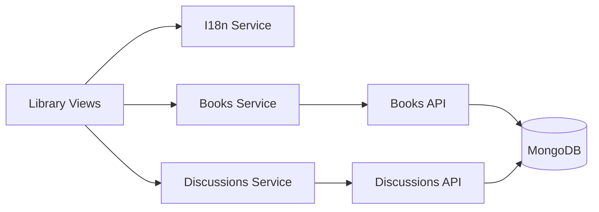
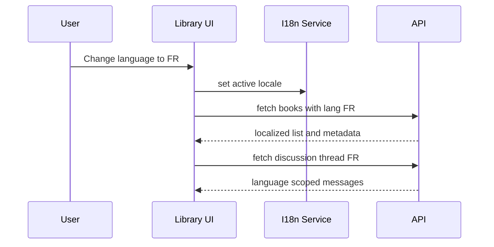
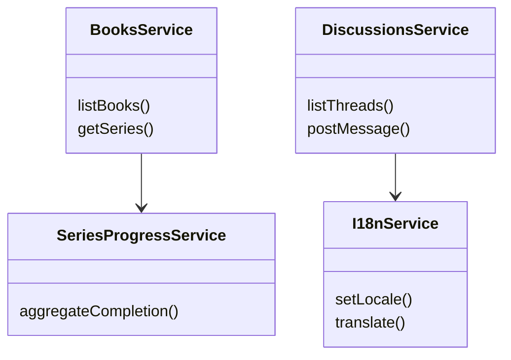
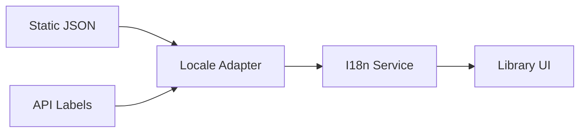
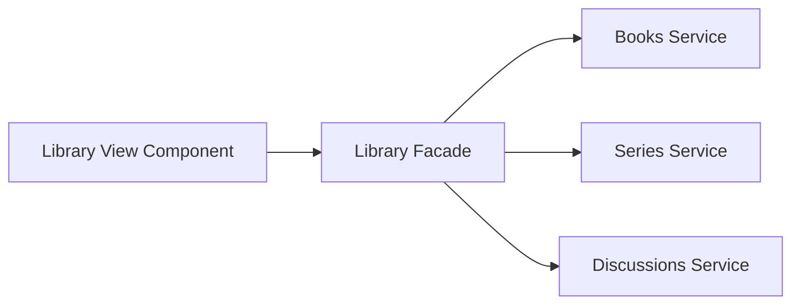
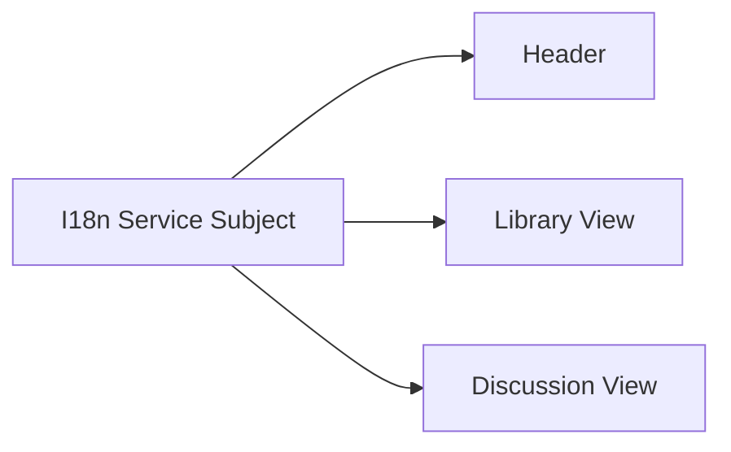

# Capsule 04 - Library and Language Module

## 1. Module Scope

- Book, series, and collection browsing.
- Language scoped content experience and translations.
- Discussion channels segmented by language context.

## 2. Capability Set

- Localized labels and runtime language switching.
- Language aware book and discussion retrieval.
- Series level completion from per book progress.
- Cross view continuity with history and stats data.

## 3. Architecture Flow Diagram



## 4. Sequence Diagram



## 5. Class Diagram



## 6. Evidence Files

- `frontend/src/app/core/services/i18n.service.ts`
- `api/src/modules/books`
- `api/src/modules/series`
- `api/src/modules/discussions`
- `api/src/modules/stats`

## 7. Code Proof Snippets

```ts
// frontend/src/app/core/services/i18n.service.ts
setLocale(locale: 'en' | 'fr') {
  this.currentLocale.set(locale);
}
```

```ts
// api/src/modules/discussions/discussions.routes.ts
router.get('/:channelId/messages', requireAuth, discussionsController.listMessages);
```

## 8. GoF Patterns Demonstrated

- Adapter
  - What it does: normalizes translation payloads from different sources (static dictionaries, backend metadata) into one frontend i18n shape.

```ts
// frontend/src/app/core/services/i18n.service.ts
function adaptDictionary(input: unknown): Record<string, string> {
  const source = (input ?? {}) as Record<string, unknown>;
  return Object.fromEntries(
    Object.entries(source).map(([key, value]) => [key, String(value ?? '')])
  );
}
```



- Facade
  - What it does: provides one library oriented API surface for UI screens so components avoid orchestrating books, series, and discussions manually.

```ts
// frontend/src/app/features/library/library.facade.ts
async function loadLibraryHome(locale: 'en' | 'fr') {
  const [books, series, threads] = await Promise.all([
    booksService.listBooks(locale),
    booksService.getSeries(locale),
    discussionsService.listThreads(locale),
  ]);
  return { books, series, threads };
}
```



- Observer
  - What it does: broadcasts locale changes so all listening views refresh labels and data in sync.

```ts
// frontend/src/app/core/services/i18n.service.ts
readonly locale$ = this.localeState.asObservable();

setLocale(next: 'en' | 'fr') {
  this.localeState.next(next);
}
```



<!-- screenshot: localized library page -->
<!-- screenshot: discussion channel segmented by language -->
