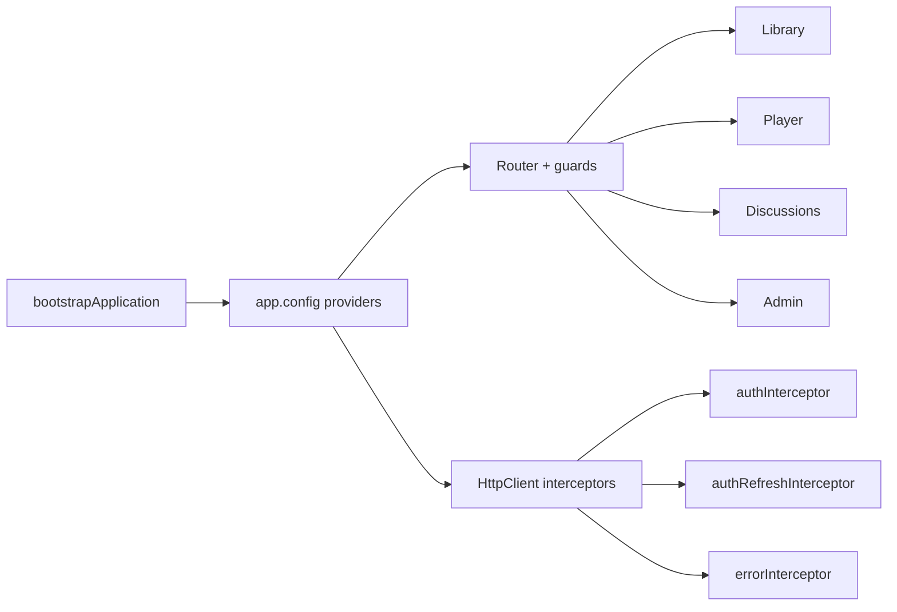
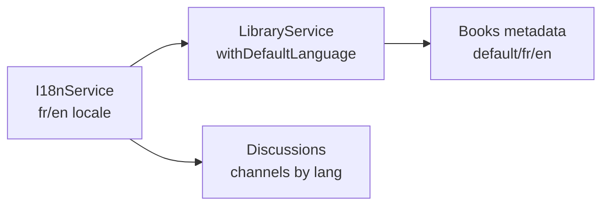

# Diagrammes - Capsule 04

## Frontend architecture

```mermaid
flowchart LR
  APP[bootstrapApplication] --> CFG[app.config providers]
  CFG --> ROUTES[Router + guards]
  CFG --> HTTP[HttpClient interceptors]

  HTTP --> I1[authInterceptor]
  HTTP --> I2[authRefreshInterceptor]
  HTTP --> I3[errorInterceptor]

  ROUTES --> F2[Library]
  ROUTES --> F3[Player]
  ROUTES --> F4[Discussions]
  ROUTES --> F6[Admin]
```

## Language-aware product flow

```mermaid
flowchart LR
  UI[I18nService\nfr/en locale]
  LIB[LibraryService\nwithDefaultLanguage]
  BOOKS[Books metadata\ndefault/fr/en]
  CHAT[Discussions\nchannels by lang]

  UI --> LIB
  LIB --> BOOKS
  UI --> CHAT
```
