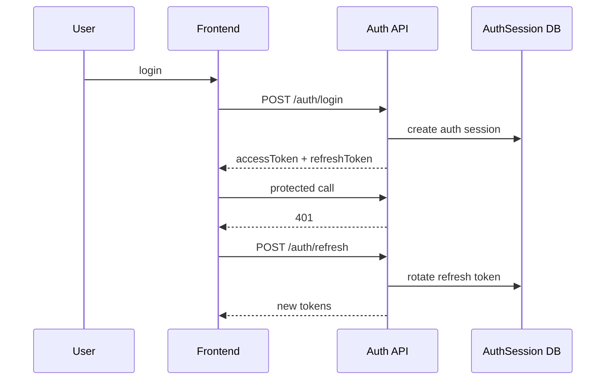
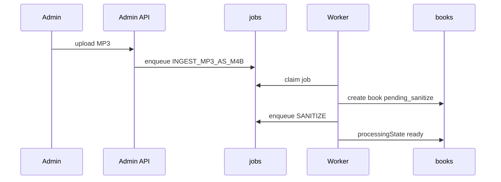
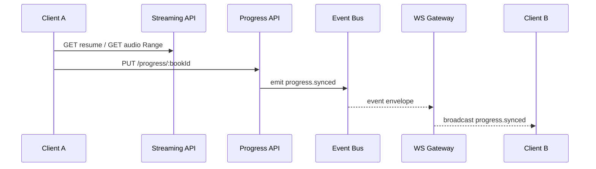

# Diagrammes - Capsule 05

## Auth + refresh

```mermaid
sequenceDiagram
  participant U as User
  participant FE as Frontend
  participant API as Auth API
  participant DB as AuthSession DB

  U->>FE: login
  FE->>API: POST /auth/login
  API->>DB: create auth session
  API-->>FE: accessToken + refreshToken
  FE->>API: protected call
  API-->>FE: 401
  FE->>API: POST /auth/refresh
  API->>DB: rotate refresh token
  API-->>FE: new tokens
```

## Ingestion MP3 -> ready

```mermaid
sequenceDiagram
  participant Admin
  participant API as Admin API
  participant Jobs as jobs
  participant W as Worker
  participant Books as books

  Admin->>API: upload MP3
  API->>Jobs: enqueue INGEST_MP3_AS_M4B
  W->>Jobs: claim job
  W->>Books: create book pending_sanitize
  W->>Jobs: enqueue SANITIZE
  W->>Books: processingState ready
```

## Streaming + progress + realtime

```mermaid
sequenceDiagram
  participant C1 as Client A
  participant S as Streaming API
  participant P as Progress API
  participant E as Event Bus
  participant G as WS Gateway
  participant C2 as Client B

  C1->>S: GET resume / GET audio Range
  C1->>P: PUT /progress/:bookId
  P->>E: emit progress.synced
  E-->>G: event envelope
  G-->>C2: broadcast progress.synced
```
