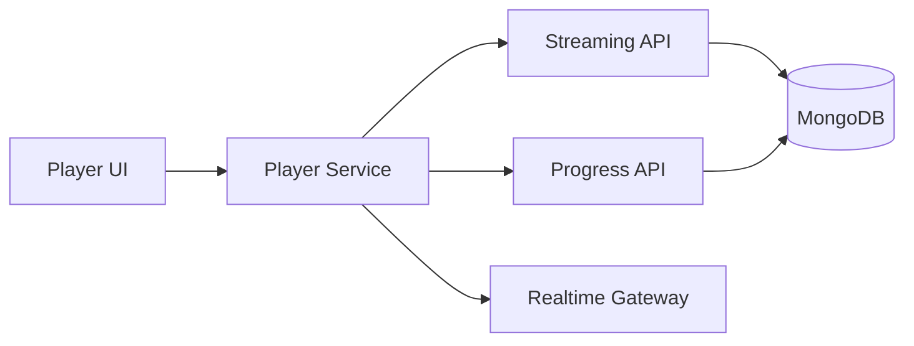
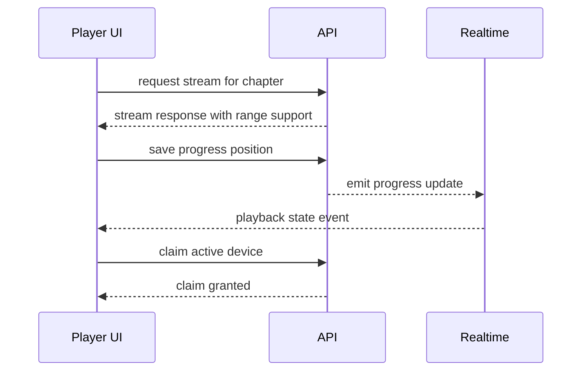
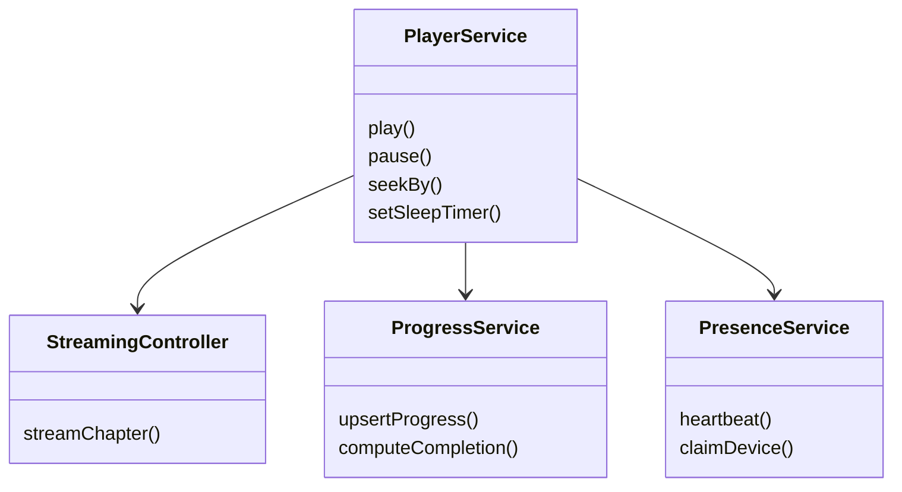
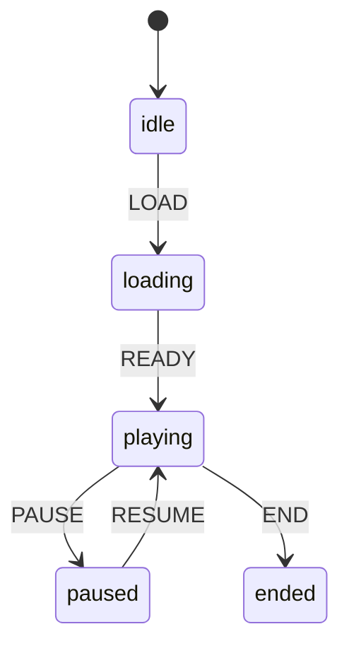
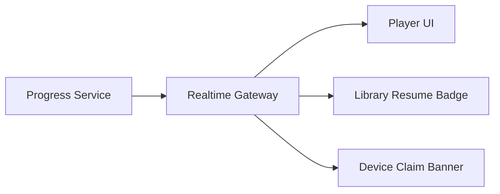
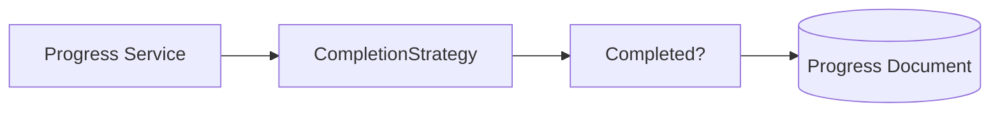

# Capsule 05 - Player Module

## 1. Module Scope

- Streaming playback and transport controls.
- Progress sync, resume rewind, and completion tracking.
- Multi device presence and playback claim ownership.

## 2. Capability Set

- Range based audio streaming.
- Idempotent progress writes and conflict safe updates.
- Presence heartbeat with active device claim.
- Player controls: seek jumps, sleep timer, pause resume.

## 3. Architecture Flow Diagram



## 4. Sequence Diagram



## 5. Class Diagram



## 6. Evidence Files

- `frontend/src/app/core/services/player.service.ts`
- `api/src/modules/streaming/stream.controller.ts`
- `api/src/modules/progress/progress.service.ts`
- `api/src/realtime/realtime.events.ts`
- `api/src/realtime/realtime.gateway.ts`

## 7. Code Proof Snippets

```ts
// frontend/src/app/core/services/player.service.ts
seekBy(seconds: number) {
  this.audio.currentTime = Math.max(0, this.audio.currentTime + seconds);
}
```

```ts
// api/src/modules/progress/progress.service.ts
await progressModel.updateOne(filter, update, { upsert: true });
```

## 8. GoF Patterns Demonstrated

- State
  - What it does: models playback lifecycle explicitly, preventing invalid transitions (for example, pause before stream is ready).

```ts
// frontend/src/app/core/services/player.service.ts
type PlaybackState = 'idle' | 'loading' | 'playing' | 'paused' | 'ended';

function transition(current: PlaybackState, event: 'LOAD' | 'READY' | 'PAUSE' | 'RESUME' | 'END'): PlaybackState {
  const table: Record<PlaybackState, Partial<Record<typeof event, PlaybackState>>> = {
    idle: { LOAD: 'loading' },
    loading: { READY: 'playing' },
    playing: { PAUSE: 'paused', END: 'ended' },
    paused: { RESUME: 'playing' },
    ended: { LOAD: 'loading' },
  };
  return table[current][event] ?? current;
}
```



- Observer
  - What it does: decouples event producers (API realtime gateway) from consumers (player UI, progress badge, device warning banner).

```ts
// api/src/realtime/realtime.events.ts
realtimeGateway.broadcastUser(userId, 'progress.updated', {
  bookId,
  chapterId,
  positionSec,
});
```



- Strategy
  - What it does: allows interchangeable completion and resume rewind behavior based on product rules or A/B settings.

```ts
// api/src/modules/progress/progress.service.ts
interface CompletionStrategy {
  isCompleted(positionSec: number, durationSec: number): boolean;
}

const ninetyPercentRule: CompletionStrategy = {
  isCompleted: (position, duration) => position / Math.max(duration, 1) >= 0.9,
};
```



<!-- screenshot: active player with timer and jump controls -->
<!-- screenshot: multi device claim warning -->
