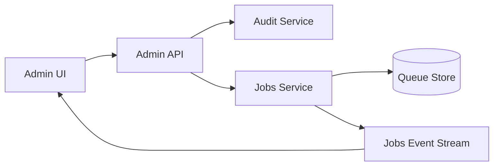
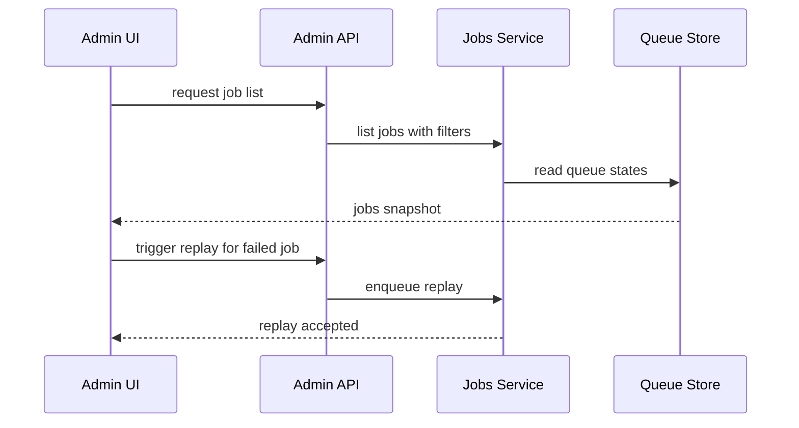
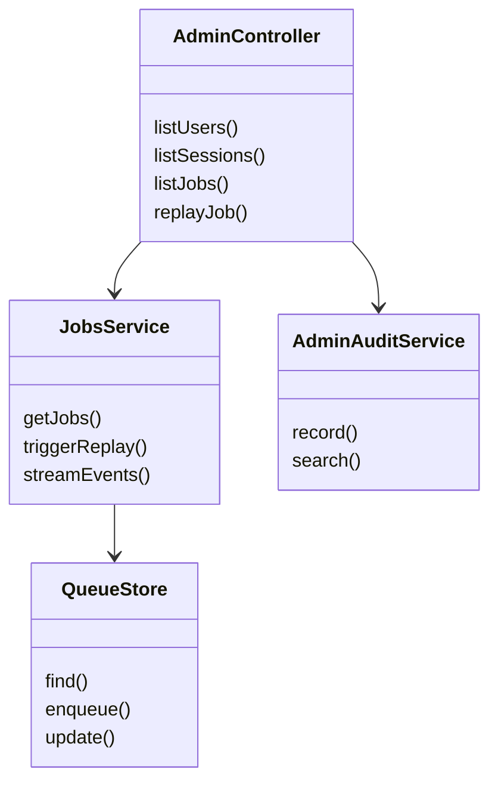
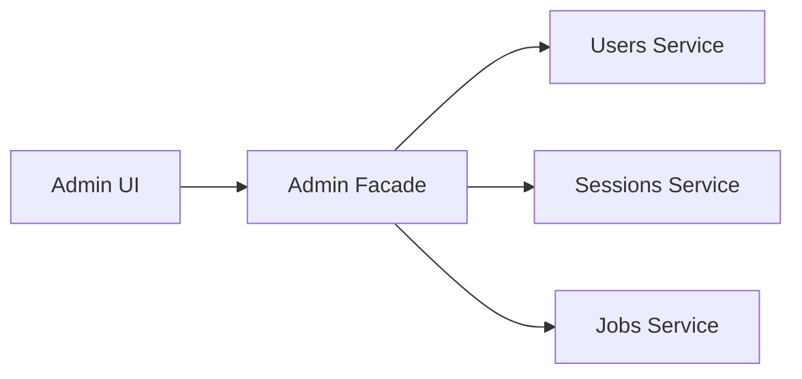
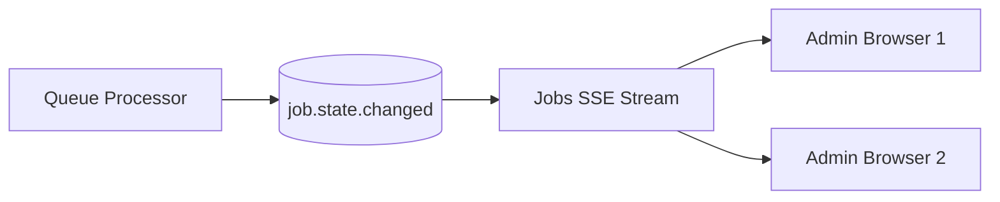
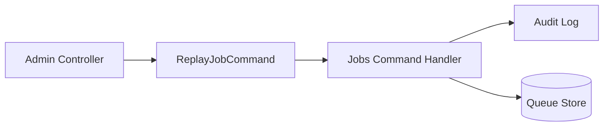

# Capsule 06 - Admin Module

## 1. Module Scope

- Operational supervision for users, sessions, jobs, and ingestion.
- Live visibility for queue health and processing status.
- Manual control actions for job operations.

## 2. Capability Set

- Admin dashboards for users and auth sessions.
- Job list filtering and status inspection.
- Manual job trigger and replay controls.
- Live updates via server sent events.

## 3. Architecture Flow Diagram



## 4. Sequence Diagram



## 5. Class Diagram



## 6. Evidence Files

- `api/src/modules/admin`
- `api/src/modules/jobs`
- `frontend/src/app/admin`
- `worker/src/queue`

## 7. Code Proof Snippets

```ts
// api/src/modules/jobs/jobs.routes.ts
router.post('/:jobId/replay', requireAdmin, jobsController.replayJob);
```

```ts
// api/src/modules/admin/admin-audit.middleware.ts
await adminAuditService.record({ actorId, action, target, metadata });
```

## 8. GoF Patterns Demonstrated

- Facade
  - What it does: exposes admin friendly operations through a single orchestration layer so UI does not call multiple domain services directly.

```ts
// api/src/modules/admin/admin.service.ts
async function getAdminOverview(filters: JobsFilters) {
  const [users, sessions, jobs] = await Promise.all([
    usersService.listRecent(),
    sessionsService.listActive(),
    jobsService.getJobs(filters),
  ]);
  return { users, sessions, jobs };
}
```



- Observer
  - What it does: streams job updates to all connected admin clients without polling.

```ts
// api/src/modules/jobs/jobs.sse.ts
jobsEvents.on('job.state.changed', (event) => {
  sseBroadcaster.publish(event);
});
```



- Command
  - What it does: captures replay/abort admin intents as explicit command objects with auditable metadata.

```ts
// api/src/modules/jobs/jobs.service.ts
type ReplayJobCommand = { actorId: string; jobId: string; reason: string };

async function handleReplayCommand(cmd: ReplayJobCommand) {
  await auditService.record({ action: 'replay-job', actorId: cmd.actorId, target: cmd.jobId });
  return queueStore.enqueueReplay(cmd.jobId);
}
```



<!-- screenshot: admin jobs dashboard -->
<!-- screenshot: admin user and session view -->
