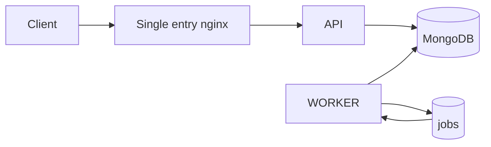

# Fiabilite et operations - Capsule 07

## Mecanismes cle

- retries avec backoff (`computeRetryDelayMs()`)
- reclaim des locks obsoletes (`reclaimStaleLocks()`)
- idempotency middleware sur routes sensibles
- rotation des refresh tokens
- exposition reseau minimale (seul nginx expose un port)

## Diagramme ops rapide

