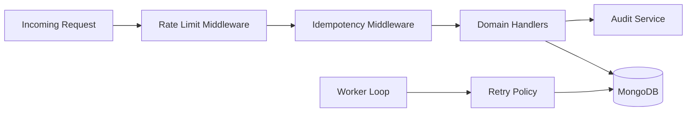
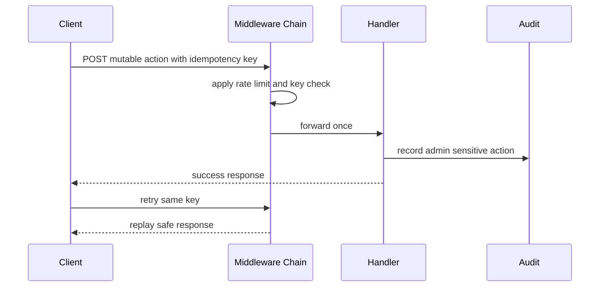
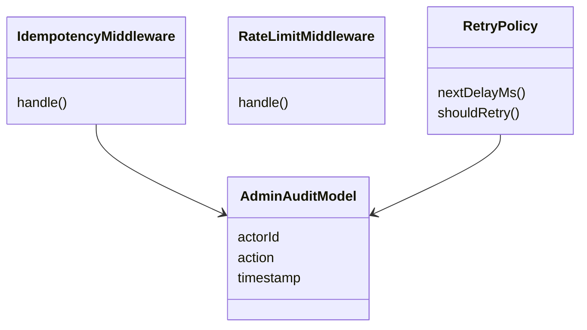
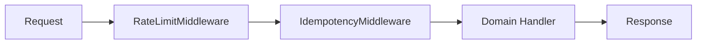
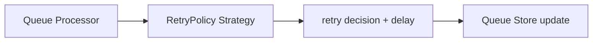
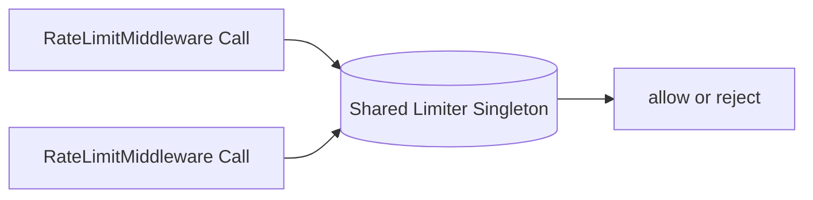

# Capsule 07 - Reliability Module

## 1. Module Scope

- Cross cutting reliability controls applied to API and worker execution.
- Request safety, abuse control, and traceability.
- Failure recovery and operational resilience.

## 2. Capability Set

- Idempotency middleware for replay safe write requests.
- Rate limiting for abusive request bursts.
- Admin audit trail for sensitive operations.
- Worker retry policy with stale lock reclaim.

## 3. Architecture Flow Diagram



## 4. Sequence Diagram



## 5. Class Diagram



## 6. Evidence Files

- `api/src/middlewares/idempotency.middleware.ts`
- `api/src/middlewares/rate-limit.middleware.ts`
- `api/src/modules/admin/admin-audit.model.ts`
- `worker/src/queue/retry-policy.ts`
- `worker/src/queue/processor.ts`

## 7. Code Proof Snippets

```ts
// api/src/middlewares/idempotency.middleware.ts
if (cachedResponse) {
  return res.status(cachedResponse.status).json(cachedResponse.body);
}
```

```ts
// worker/src/queue/retry-policy.ts
const delayMs = Math.min(baseDelayMs * 2 ** attempts, maxDelayMs);
```

## 8. GoF Patterns Demonstrated

- Chain of Responsibility
  - What it does: composes reliability concerns in order (rate limit -> idempotency -> domain handler) so each step can short circuit safely.

```ts
// api/src/app.ts
app.use(rateLimitMiddleware);
app.use(idempotencyMiddleware);
app.use('/api', apiRouter);
```



- Strategy
  - What it does: separates policy from execution so retry and throttling behavior can evolve independently from business handlers.

```ts
// worker/src/queue/retry-policy.ts
interface RetryPolicy {
  shouldRetry(attempts: number): boolean;
  nextDelayMs(attempts: number): number;
}

const boundedExponentialPolicy: RetryPolicy = {
  shouldRetry: (attempts) => attempts < 5,
  nextDelayMs: (attempts) => Math.min(1000 * 2 ** attempts, 30_000),
};
```



- Singleton
  - What it does: uses shared limiter/cache instances to keep request accounting coherent across middleware calls in a process.

```ts
// api/src/middlewares/rate-limit.middleware.ts
const limiter = createTokenBucketLimiter({ capacity: 60, refillPerMin: 60 });

export function rateLimitMiddleware(req: Request, res: Response, next: NextFunction) {
  if (!limiter.tryConsume(req.ip)) {
    return res.status(429).json({ message: 'Too many requests' });
  }
  return next();
}
```



<!-- screenshot: rate limit and abuse monitor -->
<!-- screenshot: audit timeline table -->
