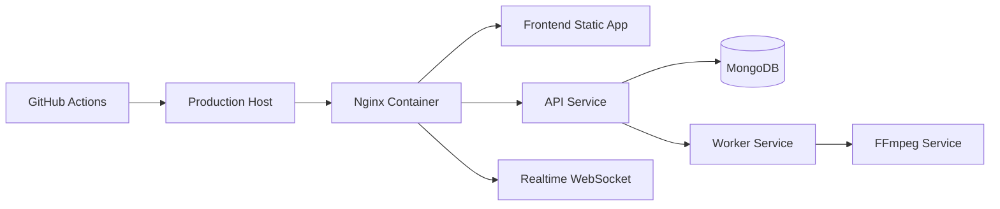
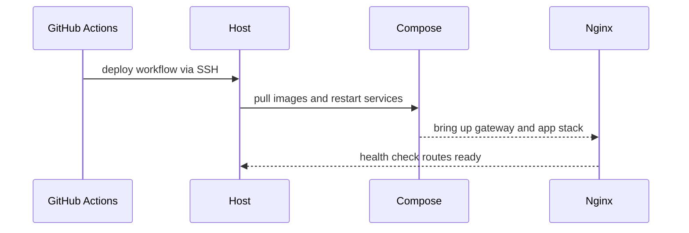
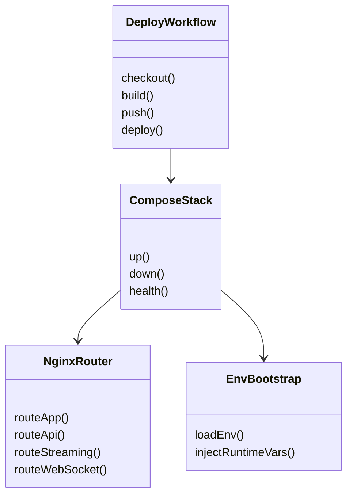
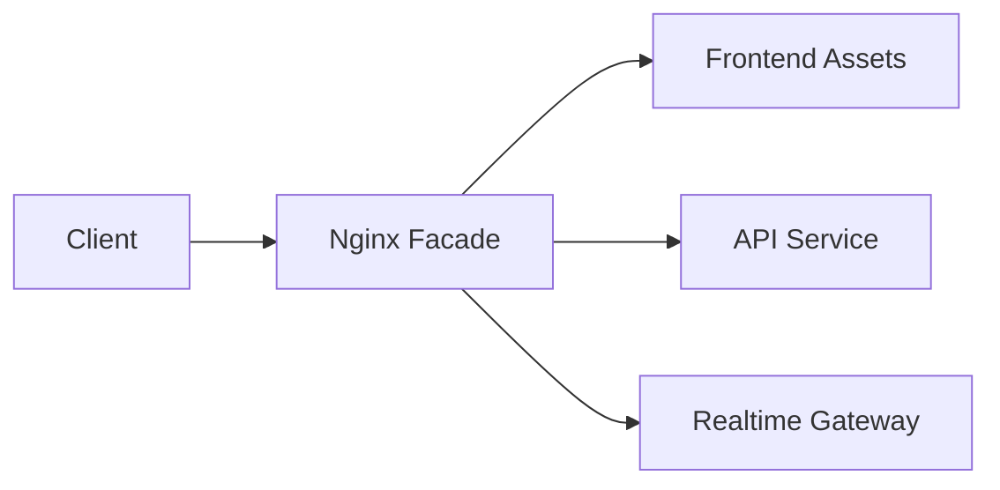
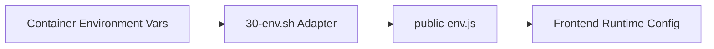

# Capsule 08 - Deployment and Delivery Module

## 1. Module Scope

- Runtime packaging and environment composition.
- Reverse proxy routing and minimal exposure model.
- Automated deployment workflow for production updates.

## 2. Capability Set

- Multi service Docker Compose stack for api, worker, ffmpeg, and nginx.
- Single ingress reverse proxy with route partition for app, api, streaming, and realtime.
- CI CD workflow that builds and deploys on remote host over SSH.
- Environment driven configuration for reproducible runtime behavior.

## 3. Architecture Flow Diagram



## 4. Sequence Diagram



## 5. Class Diagram



## 6. Evidence Files

- `docker-compose.yml`
- `infra/nginx/default.conf`
- `infra/nginx/30-env.sh`
- `.github/workflows/deploy.yml`
- `api/Dockerfile`

## 7. Code Proof Snippets

```yaml
# docker-compose.yml
services:
  nginx:
    build: ./infra/nginx
  api:
    build: ./api
  worker:
    build: ./worker
```

```nginx
# infra/nginx/default.conf
location /api/ {
  proxy_pass http://api:3000/api/;
}
location /ws {
  proxy_pass http://api:3000/ws;
}
```

## 8. GoF Patterns Demonstrated

- Facade
  - What it does: provides a single ingress (`Nginx`) for app, API, stream, and websocket routes, hiding backend topology from clients.

```nginx
# infra/nginx/default.conf
location / {
  try_files $uri /index.html;
}
location /api/ {
  proxy_pass http://api:3000/api/;
}
location /ws {
  proxy_pass http://api:3000/ws;
}
```



- Adapter
  - What it does: transforms deployment environment variables into the runtime config shape used by frontend and services.

```sh
# infra/nginx/30-env.sh
cat > /usr/share/nginx/html/env.js <<EOF
window.__env = {
  API_BASE_URL: "${API_BASE_URL}",
  WS_URL: "${WS_URL}"
};
EOF
```



- Template Method
  - What it does: enforces a repeatable deployment algorithm (checkout -> build -> deploy -> health check) with environment specific inputs.

```yaml
# .github/workflows/deploy.yml
steps:
  - uses: actions/checkout@v4
  - name: Build images
    run: docker compose build
  - name: Deploy on host
    run: ./scripts/deploy.sh
```


<!-- screenshot: deployment workflow run -->
<!-- screenshot: reverse proxy routes map -->
